# Description

Raisins can be of two species: *Kecimen* *(Class = 1)* and *Besni (Class = 0)*.\
We built different models to predict the species on the basis of the dimensions of the raisin example approximated as an ellipse.\
Data are taken from the paper: <https://dergipark.org.tr/tr/download/article-file/1227592> and are available at: <https://www.kaggle.com/datasets/muratkokludataset/raisin-dataset>

## Variables

The predictors that can be used are:

-   Area
-   MajorAxisLength
-   MinorAxisLength
-   Eccentricity
-   ConvexArea
-   Extent
-   Perimeter

The target variable is [Class.]{.underline}

# Descriptive Analysis

#### Loading Libraries


```r
library(ggplot2)
library(dplyr)
library(tidyverse)
library(tidymodels)
library(glmnet)
library(estimatr)
library(stats)
library(maxLik)
library(Matrix)
library(caret)
library(performance)
library(see)
library(corrplot)
library(GGally)
library(car)
library(FactoMineR)
library(factoextra)
library(dplyr)
library(e1071)
library(caTools)
library(class)
library(pROC)
library(tree)
library(leaps)   # best subset
library(bestglm) # best subset for logistic
library(MASS)    # diagnostics
library(olsrr)   # diagnostics
library(influence.ME)
library(DHARMa)
```

#### Loading data-set

(Aim: visualize dataset, summary, remove Class_literal)


```r
raisins = read.csv(
  "https://raw.githubusercontent.com/LeonardoAcquaroli/raisins_and_mushrooms/main/datasets/Raisin_Dataset.csv",
  sep = ";"
)

head(raisins)
```

```
##    Area MajorAxisLength MinorAxisLength Eccentricity ConvexArea    Extent
## 1 87524        442.2460        253.2912    0.8197384      90546 0.7586506
## 2 75166        406.6907        243.0324    0.8018052      78789 0.6841296
## 3 90856        442.2670        266.3283    0.7983536      93717 0.6376128
## 4 45928        286.5406        208.7600    0.6849892      47336 0.6995994
## 5 79408        352.1908        290.8275    0.5640113      81463 0.7927719
## 6 49242        318.1254        200.1221    0.7773513      51368 0.6584564
##   Perimeter Class_literal Class
## 1  1184.040       Kecimen     1
## 2  1121.786       Kecimen     1
## 3  1208.575       Kecimen     1
## 4   844.162       Kecimen     1
## 5  1073.251       Kecimen     1
## 6   881.836       Kecimen     1
```

```r
# remove the Class_literal  column  
raisins_corr <- raisins
raisins <- raisins[,-8] 
# Class: 1 if raisin is of Kecimen type, 0 if it is Besni
```

### Correlations plots

(Aim: visually represent relationships between variables)


```r
cor_table<-cor(raisins) 

corrplot(cor_table, type = "upper",     #first corr plot
         tl.col = "black", tl.srt = 45)
```

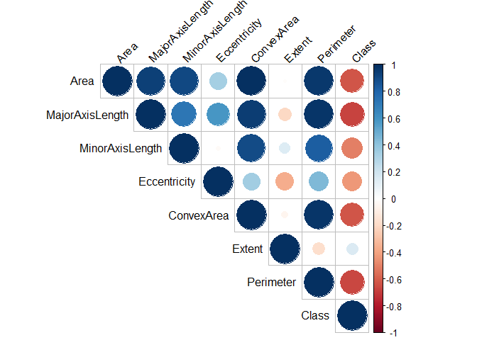<!-- -->

```r
ggcorr(raisins, method = c("everything", "pearson")) #heatmap plot
```

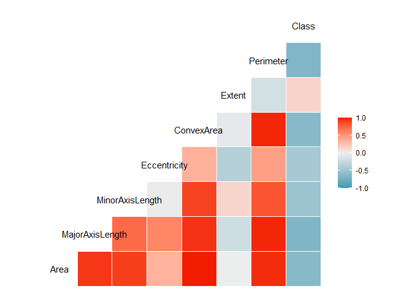<!-- -->

```r
ggpairs(raisins_corr, columns = 1:7, ggplot2::aes(colour= Class_literal, alpha = 0.005)) #cor by groups
```

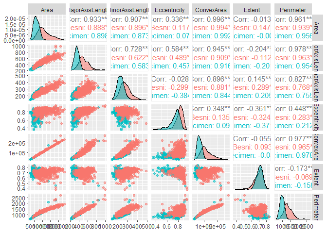<!-- -->

### Boxplot

(Aim: Identify outliers)


```r
boxplot(raisins$Area, xlab = "Area")
```

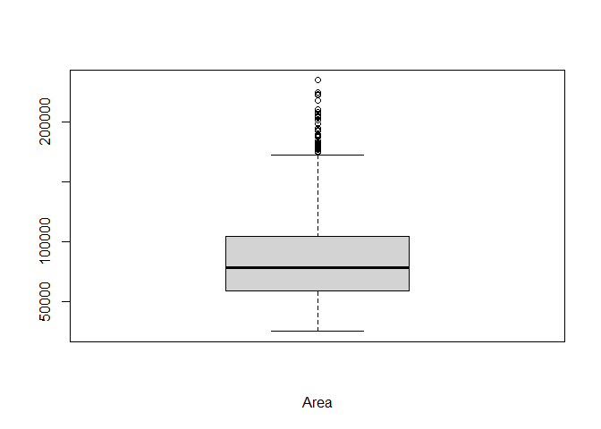<!-- -->

```r
boxplot(raisins$MajorAxisLength, xlab = "MajorAxisLength")
```

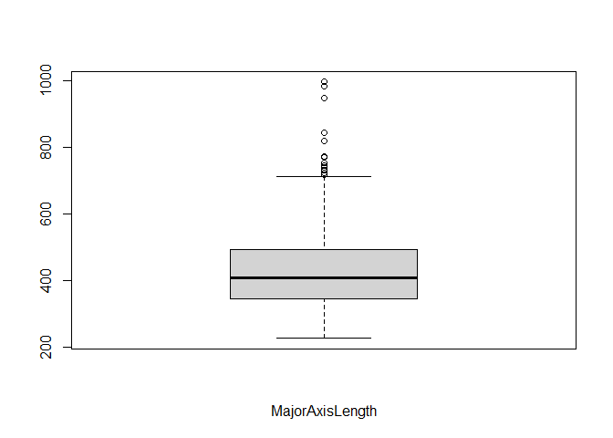<!-- -->

```r
boxplot(raisins$MinorAxisLength, xlab = "MinorAxisLength")
```

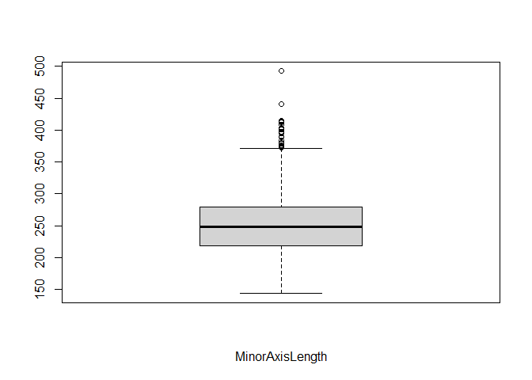<!-- -->

```r
boxplot(raisins$Eccentricity, xlab = "Eccentricity")
```

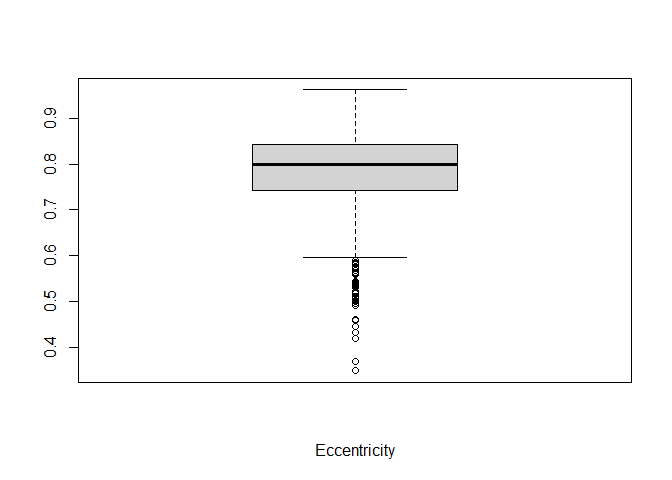<!-- -->

```r
boxplot(raisins$ConvexArea, xlab = "ConvexArea")
```

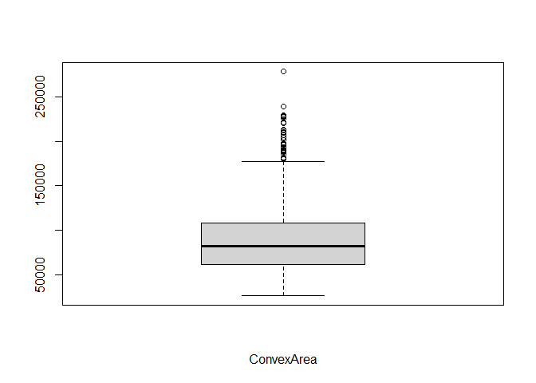<!-- -->

```r
boxplot(raisins$Extent, xlab = "Extent")
```

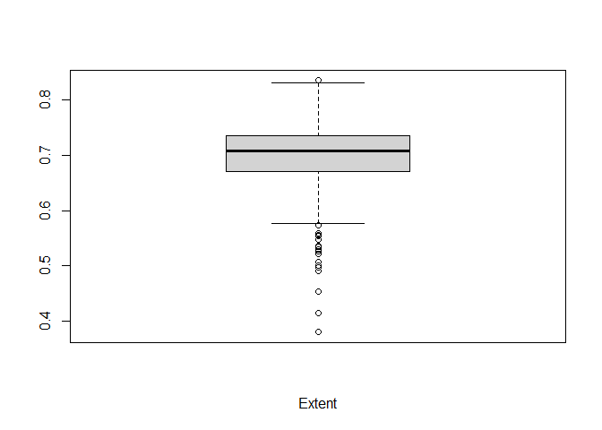<!-- -->

```r
boxplot(raisins$Perimeter, xlab = "Perimeter")
```

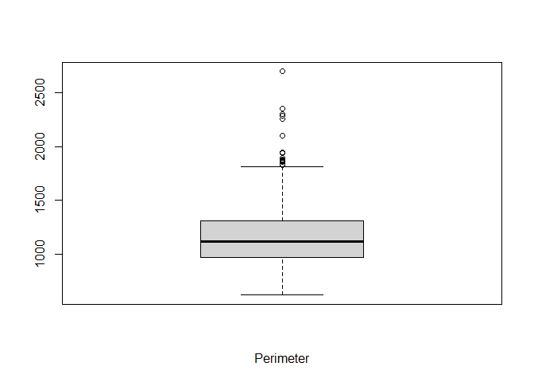<!-- -->

```r
boxplot(raisins$Class, xlab = "Class")
```

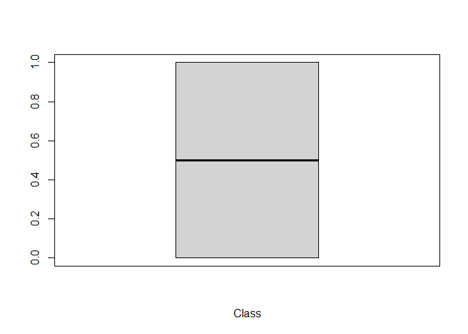<!-- -->

### Histograms highlighting class differences

(Aim: See more clearly if variables' distribution depend on Class)


```r
library(ggthemes)
```

Black: Kecimen, Yellow: Besni


```r
theme_set(theme_economist())

ggplot() +
geom_histogram(data = subset(x=raisins, subset=Class==1), 
               aes(x = Area), fill = 'black', alpha = 0.5) +
geom_histogram(data = subset(x=raisins, subset=Class==0), 
                 aes(x = Area), fill='yellow', alpha = 0.5) +
ggtitle(paste0("Comparison between Area's distribution" )) 
```

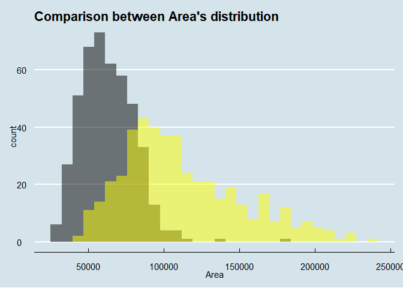<!-- -->

```r
ggplot() + 
geom_histogram(data = subset(x=raisins, subset=Class==1), 
               aes(x = MinorAxisLength), fill = 'black', alpha = 0.5) + 
geom_histogram(data = subset(x=raisins, subset=Class==0), 
               aes(x = MinorAxisLength), fill='yellow', alpha = 0.5) +
ggtitle(paste0("Comparison between MinorAxisLength's distribution" )) 
```

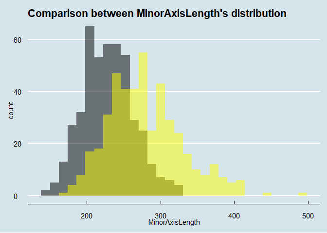<!-- -->

```r
ggplot() + 
geom_histogram(data = subset(x=raisins, subset=Class==1), 
               aes(x = Eccentricity), fill = 'black', alpha = 0.5) + 
geom_histogram(data = subset(x=raisins, subset=Class==0), 
               aes(x = Eccentricity), fill='yellow', alpha = 0.5) +
ggtitle(paste0("Comparison between Eccentricity's distribution" )) 
```

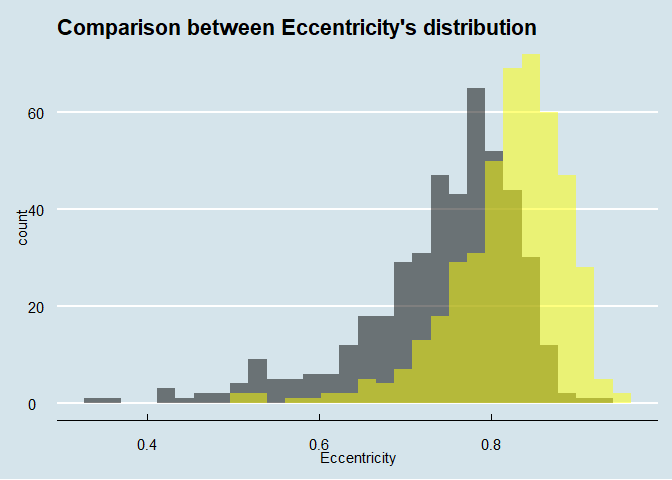<!-- -->

```r
ggplot() + 
geom_histogram(data = subset(x=raisins, subset=Class==1), 
               aes(x = ConvexArea), fill = 'black', alpha = 0.5) + 
geom_histogram(data = subset(x=raisins, subset=Class==0), 
               aes(x = ConvexArea), fill='yellow', alpha = 0.5) +
ggtitle(paste0("Comparison between ConvexArea's distribution" )) 
```

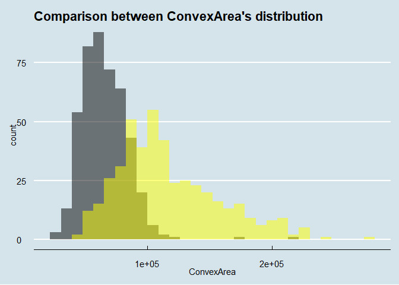<!-- -->

```r
ggplot() + 
geom_histogram(data = subset(x=raisins, subset=Class==1), 
               aes(x = Extent), fill = 'black', alpha = 0.5) + 
geom_histogram(data = subset(x=raisins, subset=Class==0), 
               aes(x = Extent), fill='yellow', alpha = 0.5) +
ggtitle(paste0("Comparison between Extent's distribution" ))
```

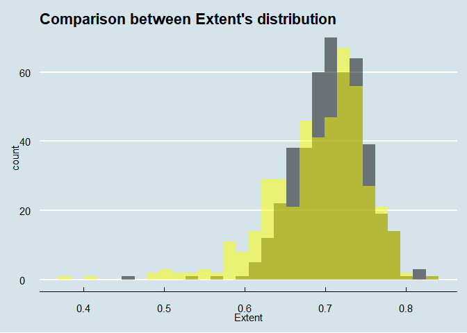<!-- -->

```r
ggplot() + 
geom_histogram(data = subset(x=raisins, subset=Class==1), 
               aes(x = Perimeter), fill = 'black', alpha = 0.5) + 
geom_histogram(data = subset(x=raisins, subset=Class==0), 
               aes(x = Perimeter), fill='yellow', alpha = 0.5) +
ggtitle(paste0("Comparison between Perimeter's distribution" ))
```

<!-- -->

# Supervised models

## We first use all the dataset

#### We run a basic ols model, which would be a linear probability model


```r
ols <- lm("Class ~ .",data=raisins)
summary(ols)
```

```
## 
## Call:
## lm(formula = "Class ~ .", data = raisins)
## 
## Residuals:
##      Min       1Q   Median       3Q      Max 
## -1.12899 -0.25192  0.01594  0.25715  1.23867 
## 
## Coefficients:
##                   Estimate Std. Error t value Pr(>|t|)    
## (Intercept)      3.568e+00  3.923e-01   9.096  < 2e-16 ***
## Area            -3.869e-05  6.034e-06  -6.412 2.33e-10 ***
## MajorAxisLength  2.189e-03  1.146e-03   1.910  0.05643 .  
## MinorAxisLength  2.154e-04  1.483e-03   0.145  0.88456    
## Eccentricity    -9.166e-01  2.957e-01  -3.100  0.00199 ** 
## ConvexArea       4.894e-05  6.059e-06   8.077 2.15e-15 ***
## Extent           8.348e-02  2.772e-01   0.301  0.76337    
## Perimeter       -3.837e-03  5.800e-04  -6.616 6.36e-11 ***
## ---
## Signif. codes:  0 '***' 0.001 '**' 0.01 '*' 0.05 '.' 0.1 ' ' 1
## 
## Residual standard error: 0.3508 on 892 degrees of freedom
## Multiple R-squared:  0.5123,	Adjusted R-squared:  0.5084 
## F-statistic: 133.8 on 7 and 892 DF,  p-value: < 2.2e-16
```

#### We check for heteroscedasticity and multicollinearity


```r
check_heteroscedasticity(ols) # there is heteroskedasticity
```

```
## Warning: Heteroscedasticity (non-constant error variance) detected (p = 0.040).
```

```r
check_model(ols)
```

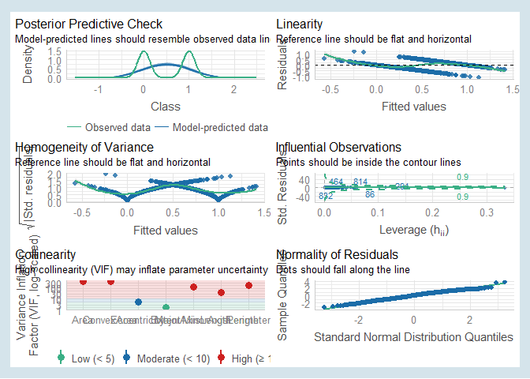<!-- -->

```r
vif(ols)
```

```
##            Area MajorAxisLength MinorAxisLength    Eccentricity      ConvexArea 
##      404.718824      129.152882       40.166637        5.210356      445.947568 
##          Extent       Perimeter 
##        1.605335      184.252844
```

```r
sqrt(vif(ols)) > 2
```

```
##            Area MajorAxisLength MinorAxisLength    Eccentricity      ConvexArea 
##            TRUE            TRUE            TRUE            TRUE            TRUE 
##          Extent       Perimeter 
##           FALSE            TRUE
```

#### There appears to be heteroscedacity, plus the multicollinearity is extremely high

#### We try to tackle multicollinearity by reducing the variables in the model. We use best subset selection.


```r
regfit.full=regsubsets(Class ~.,data=raisins, nvmax=7)
reg.summary=summary(regfit.full)
plot(reg.summary$cp,xlab="Number of Variables",ylab="Cp")
```

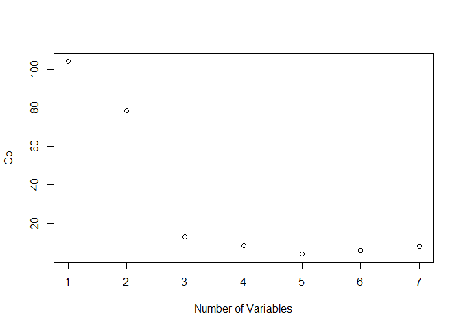

```r
which.min(reg.summary$cp)
```

```
## [1] 5
```

```r
plot(regfit.full,scale="Cp")
```

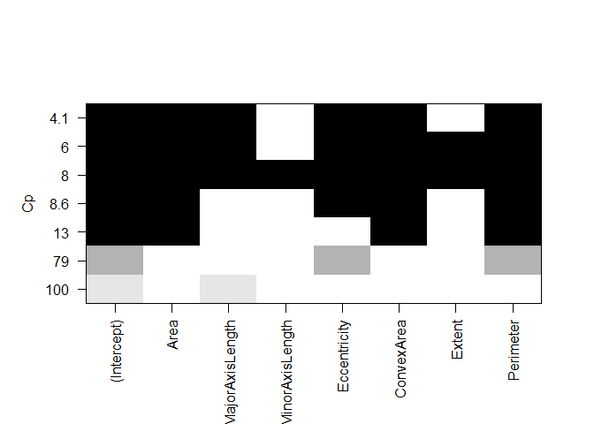

#### As we can see, the best model appears to be one with 5 variables. We run this improved ols model


```r
ols_imp <- lm("Class ~ Area + MajorAxisLength + 
              Eccentricity + ConvexArea + Perimeter",data=raisins)
summary(ols_imp)
```

```
## 
## Call:
## lm(formula = "Class ~ Area + MajorAxisLength + \n              Eccentricity + ConvexArea + Perimeter", 
##     data = raisins)
## 
## Residuals:
##      Min       1Q   Median       3Q      Max 
## -1.13065 -0.24783  0.01591  0.25803  1.24484 
## 
## Coefficients:
##                   Estimate Std. Error t value Pr(>|t|)    
## (Intercept)      3.683e+00  2.135e-01  17.252  < 2e-16 ***
## Area            -3.776e-05  4.333e-06  -8.715  < 2e-16 ***
## MajorAxisLength  2.067e-03  8.150e-04   2.536 0.011374 *  
## Eccentricity    -9.437e-01  2.628e-01  -3.591 0.000347 ***
## ConvexArea       4.842e-05  5.457e-06   8.875  < 2e-16 ***
## Perimeter       -3.805e-03  4.144e-04  -9.183  < 2e-16 ***
## ---
## Signif. codes:  0 '***' 0.001 '**' 0.01 '*' 0.05 '.' 0.1 ' ' 1
## 
## Residual standard error: 0.3504 on 894 degrees of freedom
## Multiple R-squared:  0.5122,	Adjusted R-squared:  0.5095 
## F-statistic: 187.7 on 5 and 894 DF,  p-value: < 2.2e-16
```

```r
vif(ols_imp) # the VIF is still too high!
```

```
##            Area MajorAxisLength    Eccentricity      ConvexArea       Perimeter 
##      209.089582       65.482372        4.124587      362.380343       94.243582
```

#### the VIF is extremely high.

#### Given that most of our variables are highly correlated, we identify three "proper" dimensions over which our data span.

#### Thus, we perform best subset selection specifying that we want at most 3 variables


```r
regfit.full=regsubsets(Class ~.,data=raisins, nvmax=3)
reg.summary=summary(regfit.full)
plot(regfit.full,scale="Cp")
```

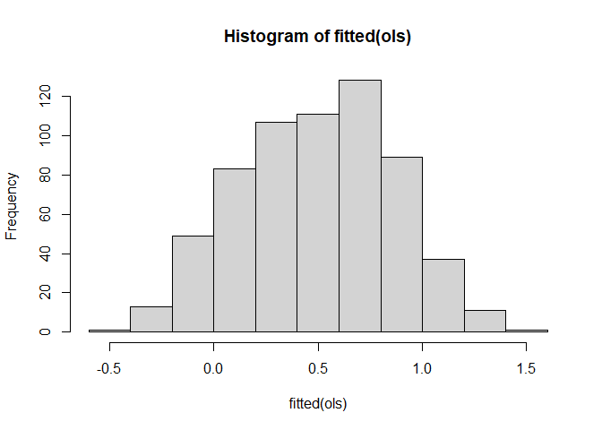

#### We observe that two variables are very similar. Thus, we opt for the minimal model with two variables.


```r
ols_imp2 <- lm("Class ~ Eccentricity + Perimeter",data=raisins)
summary(ols_imp2)
```

```
## 
## Call:
## lm(formula = "Class ~ Eccentricity + Perimeter", data = raisins)
## 
## Residuals:
##      Min       1Q   Median       3Q      Max 
## -1.03758 -0.30279  0.04866  0.28119  1.80574 
## 
## Coefficients:
##                Estimate Std. Error t value Pr(>|t|)    
## (Intercept)   2.511e+00  1.062e-01  23.634  < 2e-16 ***
## Eccentricity -9.717e-01  1.509e-01  -6.441 1.93e-10 ***
## Perimeter    -1.073e-03  4.977e-05 -21.569  < 2e-16 ***
## ---
## Signif. codes:  0 '***' 0.001 '**' 0.01 '*' 0.05 '.' 0.1 ' ' 1
## 
## Residual standard error: 0.3653 on 897 degrees of freedom
## Multiple R-squared:  0.4681,	Adjusted R-squared:  0.4669 
## F-statistic: 394.8 on 2 and 897 DF,  p-value: < 2.2e-16
```

```r
vif(ols_imp2)
```

```
## Eccentricity    Perimeter 
##     1.250884     1.250884
```

```r
check_model(ols_imp2)
```

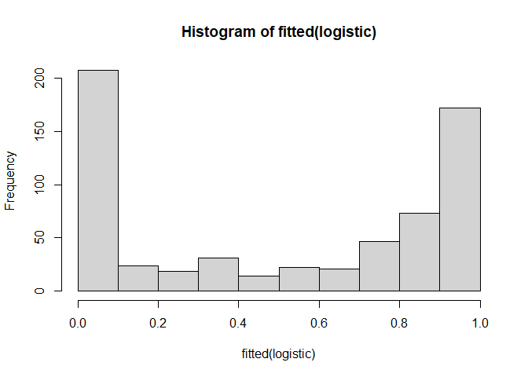<!-- -->

#### ols_imp2 is our final model as far as linear regression goes. We now focus on its residuals.


```r
raw_res <- residuals(ols_imp2)
threshold <- 3 * sd(raw_res)  # Define threshold as 3 times the SD
threshold# how are the residuals distributed?
```

```
## [1] 1.094547
```

```r
hist(raw_res, breaks = 30, main = "Histogram of Raw Residuals", xlab = "Raw Residuals")
```

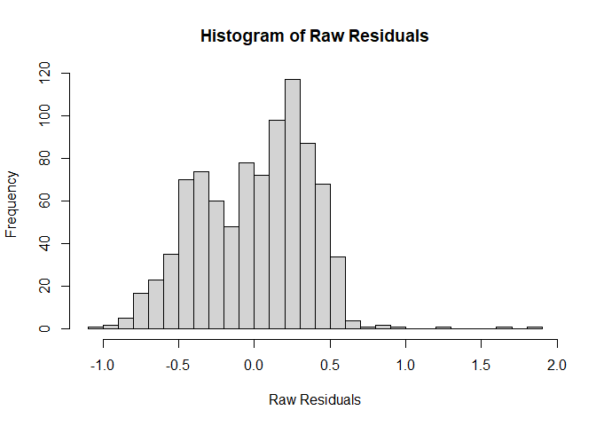<!-- -->

#### We also compute Cook's distance and plot it with the residuals


```r
cooks_dist <- cooks.distance(ols_imp2)
cooks_threshold <- 4/897
plot(cooks_dist, raw_res, main = "Cook's Distance vs. Raw Residuals",
     xlab = "Cook's Distance", ylab = "Raw Residuals")
abline(h = 0, lty = 2, col = "red")  # Reference line at y = 0
abline(h = threshold, lty = 3, col = "blue")  # Threshold line for raw residuals (upper)
abline(h = -threshold, lty = 3, col = "blue")  # Threshold line for raw residuals (lower)
abline(v = cooks_threshold, lty = 3, col = "green")
text(cooks_dist, raw_res, labels = 1:length(cooks_dist), pos = 3)
```

<!-- -->

#### The most problematic observations appear to be: 695, 507, 837, 291, 86, 488. We should dig deeper into them.


```r
outliers_obs <- c(695, 507, 837, 291, 86, 488)
outliers_df <- raisins[outliers_obs, ]
non_outliers_df <- raisins[-outliers_obs, ]

# Plot without outliers
p <- ggplot(non_outliers_df, aes(x = Perimeter, y = Eccentricity)) +
  geom_point() +
  labs(title = "Scatter Plot emphasising outliers",
       x = "Perimeter",
       y = "Eccentricity")

# Add outliers with distinct color
p <- p +
  geom_point(data = outliers_df, color = "red", size = 3) +
  geom_text(data = outliers_df, aes(label = paste(rownames(outliers_df))), vjust = -1)

# Median values
p <- p +
  geom_vline(aes(xintercept = median(Perimeter)), linetype = "dashed") +
  geom_hline(aes(yintercept = median(Eccentricity)), linetype = "dashed")

# Regression line
p <- p +
  geom_smooth(method = "lm", se = FALSE) +
  geom_smooth(data = non_outliers_df, method = "lm", se = FALSE, linetype = "dashed", color = "blue")

# Display the plot
print(p)
```

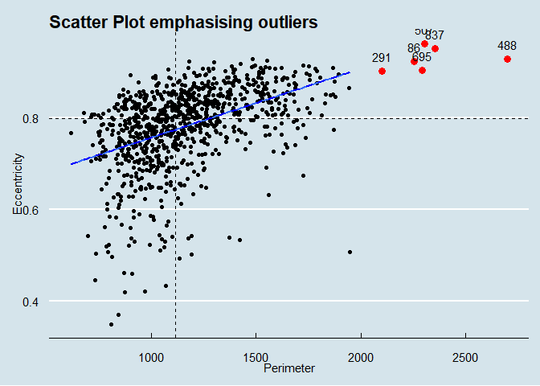

#### These observations clearly have a very large "Perimeter", however they do not appear to be completely out of this world. <br> We can still try to remove them and see how the performance changes. <br> We now plot the accuracy of our model on the whole dataset


```r
#computation of the accuracy on the full dataset
fitvols_fulld = predict(ols_imp2, raisins) # fulld identifies the full dataset
predols_fulld = ifelse(fitvols_fulld < 0.50, 0, 1)
accols_fulld = raisins$Class == predols_fulld
table(accols_fulld)
```

```
## accols_fulld
## FALSE  TRUE 
##   124   776
```

```r
accuracy_ols_fulld <- 776/900
accuracy_ols_fulld
```

```
## [1] 0.8622222
```

#### Given that we found heteroscedasticity, we perform the same model with the robust option.


```r
#ROBUST OLS
ols_robust <- lm_robust(Class ~ Eccentricity + Perimeter , data = raisins, se_type = "HC2")
summary(ols_robust)
```

```
## 
## Call:
## lm_robust(formula = Class ~ Eccentricity + Perimeter, data = raisins, 
##     se_type = "HC2")
## 
## Standard error type:  HC2 
## 
## Coefficients:
##               Estimate Std. Error t value   Pr(>|t|)  CI Lower   CI Upper  DF
## (Intercept)   2.510968  1.002e-01  25.069 1.541e-105  2.314392  2.7075452 897
## Eccentricity -0.971708  1.367e-01  -7.108  2.403e-12 -1.240012 -0.7034040 897
## Perimeter    -0.001073  6.693e-05 -16.039  4.297e-51 -0.001205 -0.0009421 897
## 
## Multiple R-squared:  0.4681 ,	Adjusted R-squared:  0.4669 
## F-statistic: 251.8 on 2 and 897 DF,  p-value: < 2.2e-16
```

#### We compute the accuracy as we did before


```r
fitvolsrob_fulld = predict(ols_robust, raisins) # fulld identifies the full dataset
predolsrob_fulld = ifelse(fitvolsrob_fulld < 0.50, 0, 1)
accolsrob_fulld = raisins$Class == predolsrob_fulld
table(accolsrob_fulld)
```

```
## accolsrob_fulld
## FALSE  TRUE 
##   124   776
```

```r
accuracy_olsrob_fulld <- 776/900
accuracy_olsrob_fulld
```

```
## [1] 0.8622222
```

#### We now remove the "outliers" from the dataset and preform the very same models.


```r
raisins_noout <- raisins[!(row.names(raisins) %in% c(695, 507, 837, 291, 86, 488)), ]
```

#### First the "normal" model


```r
ols_imp2_n <- lm("Class ~ Eccentricity + Perimeter",data=raisins_noout) # _n identifies no outliers
summary(ols_imp2_n)
```

```
## 
## Call:
## lm(formula = "Class ~ Eccentricity + Perimeter", data = raisins_noout)
## 
## Residuals:
##      Min       1Q   Median       3Q      Max 
## -1.06624 -0.28222  0.05692  0.27255  0.76195 
## 
## Coefficients:
##                Estimate Std. Error t value Pr(>|t|)    
## (Intercept)   2.6476056  0.1026150  25.801  < 2e-16 ***
## Eccentricity -0.9332612  0.1442159  -6.471  1.6e-10 ***
## Perimeter    -0.0012245  0.0000504 -24.296  < 2e-16 ***
## ---
## Signif. codes:  0 '***' 0.001 '**' 0.01 '*' 0.05 '.' 0.1 ' ' 1
## 
## Residual standard error: 0.3489 on 891 degrees of freedom
## Multiple R-squared:  0.5147,	Adjusted R-squared:  0.5136 
## F-statistic: 472.5 on 2 and 891 DF,  p-value: < 2.2e-16
```

```r
fitvols_fulld_n = predict(ols_imp2_n, raisins_noout) # fulld identifies the full dataset
predols_fulld_n = ifelse(fitvols_fulld_n < 0.50, 0, 1)
accols_fulld_n = raisins_noout$Class == predols_fulld_n
table(accols_fulld_n)
```

```
## accols_fulld_n
## FALSE  TRUE 
##   122   772
```

```r
accuracy_ols_fulld_n <- 772/894
accuracy_ols_fulld_n
```

```
## [1] 0.8635347
```

#### Then the robust one


```r
ols_rob_n <- lm("Class ~ Eccentricity + Perimeter",data=raisins_noout) # _n identifies no-outliers
summary(ols_rob_n)
```

```
## 
## Call:
## lm(formula = "Class ~ Eccentricity + Perimeter", data = raisins_noout)
## 
## Residuals:
##      Min       1Q   Median       3Q      Max 
## -1.06624 -0.28222  0.05692  0.27255  0.76195 
## 
## Coefficients:
##                Estimate Std. Error t value Pr(>|t|)    
## (Intercept)   2.6476056  0.1026150  25.801  < 2e-16 ***
## Eccentricity -0.9332612  0.1442159  -6.471  1.6e-10 ***
## Perimeter    -0.0012245  0.0000504 -24.296  < 2e-16 ***
## ---
## Signif. codes:  0 '***' 0.001 '**' 0.01 '*' 0.05 '.' 0.1 ' ' 1
## 
## Residual standard error: 0.3489 on 891 degrees of freedom
## Multiple R-squared:  0.5147,	Adjusted R-squared:  0.5136 
## F-statistic: 472.5 on 2 and 891 DF,  p-value: < 2.2e-16
```

```r
fitvolsrob_fulld_n = predict(ols_rob_n, raisins_noout) # fulld identifies the full dataset
predolsrob_fulld_n = ifelse(fitvolsrob_fulld_n < 0.50, 0, 1)
accolsrob_fulld_n = raisins_noout$Class == predolsrob_fulld_n
table(accolsrob_fulld_n)
```

```
## accolsrob_fulld_n
## FALSE  TRUE 
##   122   772
```

```r
accuracy_olsrob_fulld_n <- 772/894
accuracy_olsrob_fulld_n
```

```
## [1] 0.8635347
```

### We now move to logistic regression


```r
logistic_model <-  glm(Class ~ ., data = raisins, family = binomial(link = 'logit'))
tidy(logistic_model)
```

```
## # A tibble: 8 × 5
##   term             estimate std.error statistic      p.value
##   <chr>               <dbl>     <dbl>     <dbl>        <dbl>
## 1 (Intercept)      2.23      7.04         0.317 0.751       
## 2 Area            -0.000501  0.000124    -4.03  0.0000566   
## 3 MajorAxisLength  0.0446    0.0160       2.79  0.00524     
## 4 MinorAxisLength  0.0911    0.0269       3.38  0.000722    
## 5 Eccentricity     3.89      4.91         0.792 0.428       
## 6 ConvexArea       0.000409  0.000119     3.43  0.000594    
## 7 Extent           0.683     2.72         0.251 0.802       
## 8 Perimeter       -0.0361    0.00661     -5.46  0.0000000468
```

```r
vif(logistic_model)
```

```
##            Area MajorAxisLength MinorAxisLength    Eccentricity      ConvexArea 
##      490.367743       70.630453       83.217726       12.954578      475.455021 
##          Extent       Perimeter 
##        1.328813       70.195325
```

```r
hist(fitted(logistic_model))
```

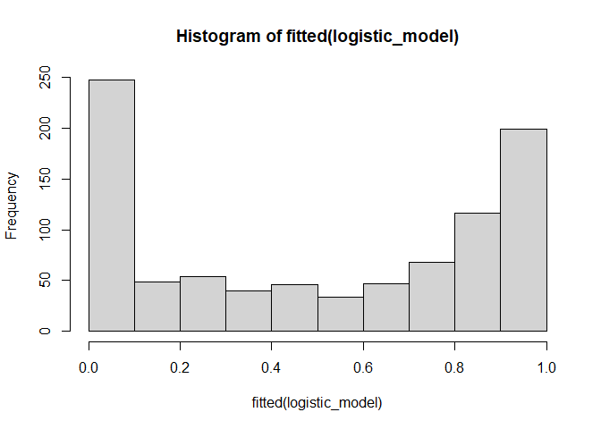

#### We perform best subset selection on the logistic model as well


```r
bestglm(raisins, family = gaussian, IC = "BIC")
```

```
## BIC
## BICq equivalent for q in (5.38544187023149e-09, 0.532772479819852)
## Best Model:
##                  Estimate   Std. Error    t value     Pr(>|t|)
## (Intercept)  3.228091e+00 1.445365e-01  22.334086 3.460498e-88
## Area        -3.835214e-05 4.104717e-06  -9.343431 7.200693e-20
## ConvexArea   5.187278e-05 5.028354e-06  10.316057 1.180887e-23
## Perimeter   -3.508593e-03 2.454475e-04 -14.294674 6.599333e-42
```

```r
imp_logistic_model <- glm(Class ~ Area + ConvexArea + Perimeter, 
                    data = raisins, 
                    family = binomial(link = 'logit'))
vif(imp_logistic_model)
```

```
##       Area ConvexArea  Perimeter 
##  422.14309  554.65662   22.25865
```

#### These still appears to have multicollinearity issues.

#### As before, we use our intuition to build a minimal logistic model

#### We actually build two of them:


```r
minimal1_logistic_model <-  glm(Class ~ Extent + Eccentricity, data = raisins, family = binomial(link = 'logit'))
vif(minimal1_logistic_model)
```

```
##       Extent Eccentricity 
##     1.116328     1.116328
```

```r
minimal2_logistic_model <-  glm(Class ~ Eccentricity + Perimeter, data = raisins,family = binomial(link = 'logit'))
vif(minimal2_logistic_model)
```

```
## Eccentricity    Perimeter 
##     1.012988     1.012988
```

#### We now create a table with the accuracies of all our models


```r
accuracies <- data.frame(Model = character(),
                         Accuracy = numeric())

models <- list(logistic = logistic_model, 
               imp_logistic = imp_logistic_model,
               minimal_logit_extent = minimal1_logistic_model,
               minimal_logit_perimeter = minimal2_logistic_model,
               lpm = ols_imp2,
               lpm_rob = ols_robust)

for (model_name in names(models)) {
  model <- models[[model_name]]
  
  # Predict the outcome probabilities using the logistic regression model
  pred_pr <- predict(model, raisins, type = "response")
  # Convert the predicted probabilities to binary predictions (0 or 1)
  pred_val <- ifelse(pred_pr > 0.5, 1, 0)
  # Compare the predicted values with the actual outcome variable
  actual_values <- raisins$Class
  # Compute the number of correctly predicted values
  correctly_pred <- sum(pred_val == actual_values)
  # Compute the percentage of correctly predicted values
  accuracy <- correctly_pred / length(actual_values) * 100
  # Append the accuracy to the "accuracies" data frame
  accuracies <- rbind(accuracies, data.frame(Model = model_name, Accuracy = accuracy))
}

accuracies
```

```
##                     Model Accuracy
## 1                logistic 85.77778
## 2            imp_logistic 85.33333
## 3    minimal_logit_extent 70.77778
## 4 minimal_logit_perimeter 86.44444
## 5                     lpm 86.22222
## 6                 lpm_rob 86.22222
```

#### Since the minimal logisitc model with the perimeter is the best one, we compute diagnostics on it.


```r
predicted_probs_logit <- predict(minimal2_logistic_model, type = "response")
residuals_logit <- raisins$Class - predicted_probs_logit

plot(predicted_probs_logit, raisins$Class, xlab = "Predicted Probabilities", ylab = "Observed Responses",
     main = "Observed vs. Predicted Probabilities", pch = 16)
```

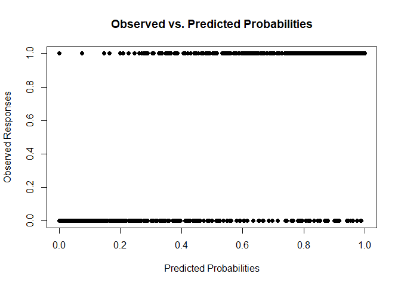<!-- -->

```r
#check relations with each predictor
plot(raisins$Eccentricity, residuals_logit, xlab = "Eccentricity", ylab = "Standardized Residuals",
     main = "Standardized Residuals vs. Predictor 1", pch = 16)
```

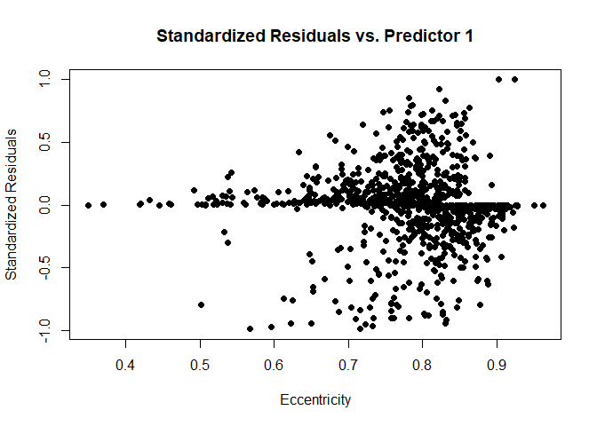<!-- -->

```r
plot(raisins$Perimeter, residuals_logit, xlab = "Perimeter", ylab = "Standardized Residuals",
     main = "Standardized Residuals vs. Predictor 1", pch = 16)
```

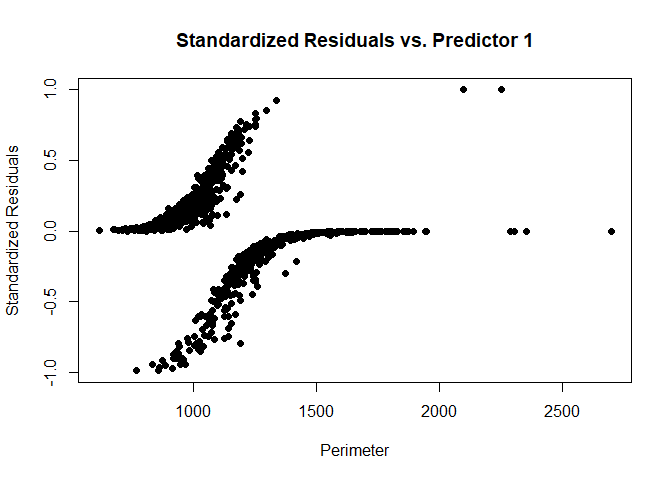<!-- -->

```r
# Diagnostics with DHARMa

# Create a simulated residuals object
simulated_residuals <- simulateResiduals(minimal2_logistic_model, n = 100)
# Plot standardized residuals using DHARMa's built-in diagnostic plots
plot(simulated_residuals)
```

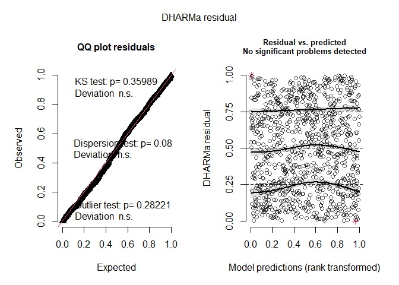<!-- -->

### Comparison of all the models so far


```r
# Compare all the models
compare_performance(ols_imp2, ols_robust, minimal2_logistic_model)
```

```
## # Comparison of Model Performance Indices
## 
## Name                    |     Model | AIC (weights) | AICc (weights) | BIC (weights) |  RMSE | Sigma |    R2 | R2 (adj.) | Tjur's R2 | Log_loss | Score_log | Score_spherical |   PCP
## -------------------------------------------------------------------------------------------------------------------------------------------------------------------------------------
## ols_imp2                |        lm | 746.2 (<.001) |  746.2 (<.001) | 765.4 (<.001) | 0.365 | 0.365 | 0.468 |     0.467 |           |          |           |                 |      
## ols_robust              | lm_robust | 746.2 (<.001) |  746.2 (<.001) | 765.4 (<.001) | 0.365 | 0.365 | 0.468 |     0.467 |           |          |           |                 |      
## minimal2_logistic_model |       glm | 636.2 (>.999) |  636.3 (>.999) | 650.6 (>.999) | 0.320 | 0.838 |       |           |     0.574 |    0.350 |      -Inf |           0.008 | 0.787
```

```r
plot(compare_performance(ols_imp2, minimal2_logistic_model, rank = TRUE, verbose = FALSE))
```

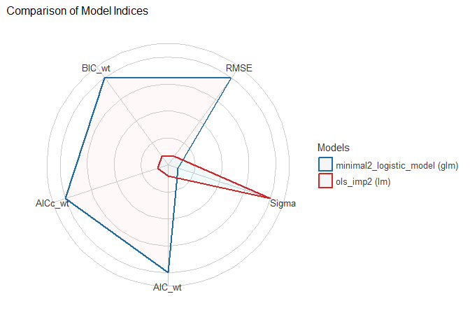<!-- -->

```r
accuracies
```

```
##                     Model Accuracy
## 1                logistic 85.77778
## 2            imp_logistic 85.33333
## 3    minimal_logit_extent 70.77778
## 4 minimal_logit_perimeter 86.44444
## 5                     lpm 86.22222
## 6                 lpm_rob 86.22222
```

## We now performe some actual statistical learning

#### We split our data in train and test set


```r
library(caret)

set.seed(42)
training_index = createDataPartition(raisins$Class, p=0.7, list = FALSE) # index of the train set examples
train = raisins[training_index,]
test = raisins[-training_index,]
```

#### MSE Function

(Aim: to evaluate the performance of predictive models)


```r
mse = function(predictions,data,y){
  residuals = (predictions - (data[c(y)]))
  mse = (1/nrow(data))*sum((residuals^2))
  return(mse)
}
```

#### Accuracy function


```r
# Casual Deep Learning accuracy function
CDP_accuracy <- function(test_predictions_vector, test_set){
        model_classes = ifelse(test_predictions_vector >= 0.5, 1,0)
        modelCM<-table(model_classes,test_set$Class)
        modelCM
        model_right_guesses = modelCM[1] + modelCM[4]
        model_accuracy = model_right_guesses/length(model_classes)
        return(model_accuracy)
        }
```

## MODELS

### 1. OLS


```r
# Fit the linear regression model
ols = lm("Class ~ Perimeter + Eccentricity",data=train)
# Summary of the model
print(summary(ols))
```

```
## 
## Call:
## lm(formula = "Class ~ Perimeter + Eccentricity", data = train)
## 
## Residuals:
##      Min       1Q   Median       3Q      Max 
## -0.99737 -0.29624  0.05971  0.27956  1.33647 
## 
## Coefficients:
##                Estimate Std. Error t value Pr(>|t|)    
## (Intercept)   2.491e+00  1.256e-01  19.836  < 2e-16 ***
## Perimeter    -1.115e-03  5.709e-05 -19.525  < 2e-16 ***
## Eccentricity -8.843e-01  1.762e-01  -5.019 6.79e-07 ***
## ---
## Signif. codes:  0 '***' 0.001 '**' 0.01 '*' 0.05 '.' 0.1 ' ' 1
## 
## Residual standard error: 0.3584 on 627 degrees of freedom
## Multiple R-squared:  0.4887,	Adjusted R-squared:  0.4871 
## F-statistic: 299.7 on 2 and 627 DF,  p-value: < 2.2e-16
```


```r
# Predictions on the test data
ols_test_predictions = predict.lm(ols,newdata = test)
# Histogram of the fitted values
hist(fitted(ols))
```

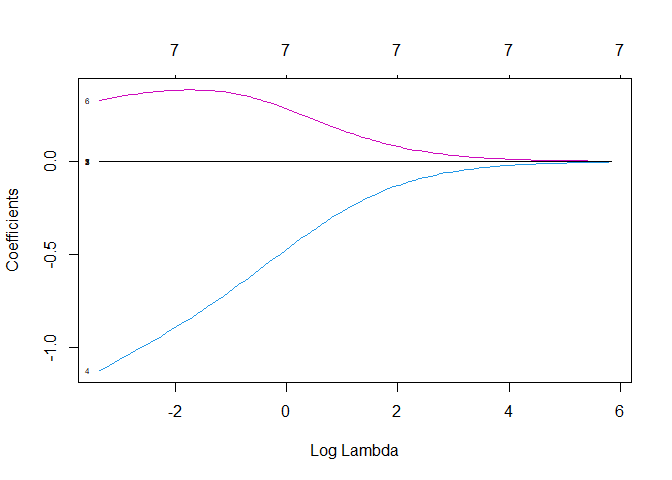<!-- -->

```r
# Calculate MSE for the training data
mse_train<-mse(fitted(ols), train, "Class") #training error
mse_train
```

```
## [1] 0.1278151
```

```r
# Calculate MSE for the test data
mse_test<-mse(ols_test_predictions,test,"Class") #test error
# Calculate accuracy
CDP_accuracy(ols_test_predictions, test)
```

```
## [1] 0.8555556
```

```r
mse_test # it was 0.1346953 before changing variables # it's 0.145 after reducing the model
```

```
## [1] 0.1453523
```

### 2. ROBUST OLS


```r
library(sandwich)
library(lmtest)
library(MASS)

# Fit the robust linear regression model
ols_robust = rlm(Class ~ ., data = train, se_type = "HC2")
# Summary of the robust model
summary(ols_robust)
```

```
## 
## Call: rlm(formula = Class ~ ., data = train, se_type = "HC2")
## Residuals:
##      Min       1Q   Median       3Q      Max 
## -1.19202 -0.24001  0.01411  0.23545  0.70461 
## 
## Coefficients:
##                 Value   Std. Error t value
## (Intercept)      3.8754  0.4719     8.2122
## Area             0.0000  0.0000    -5.1532
## MajorAxisLength  0.0022  0.0014     1.6373
## MinorAxisLength -0.0002  0.0018    -0.1314
## Eccentricity    -0.8842  0.3523    -2.5096
## ConvexArea       0.0000  0.0000     6.9109
## Extent           0.0672  0.3316     0.2028
## Perimeter       -0.0042  0.0007    -5.9900
## 
## Residual standard error: 0.3521 on 622 degrees of freedom
```

```r
# Predictions on the test data
ols_robust_test_predictions = predict(ols_robust, newdata = test)
# Histogram of the fitted values
hist(fitted(ols_robust))
```

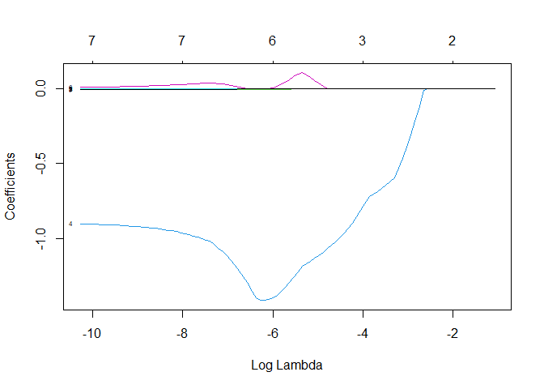<!-- -->

```r
# Calculate MSE for the training data
mse(fitted(ols_robust), train, "Class") #training error
```

```
## [1] 0.1175795
```

```r
# Calculate MSE for the test data
mse(ols_robust_test_predictions, test, "Class") #test error
```

```
## [1] 0.1356805
```

```r
# Calculate accuracy
CDP_accuracy(ols_robust_test_predictions, test)
```

```
## [1] 0.8481481
```

### 3. LOGISTIC


```r
library(broom)

# 3. Logistic before diagnostic
logistic = glm(Class ~ ., data = train, family = binomial(link = 'logit'))
tidy(logistic)
```

```
## # A tibble: 8 × 5
##   term              estimate std.error statistic p.value
##   <chr>                <dbl>     <dbl>     <dbl>   <dbl>
## 1 (Intercept)     -13.3       8.67       -1.54   0.124  
## 2 Area              0.000473  0.000228    2.08   0.0377 
## 3 MajorAxisLength   0.0184    0.0222      0.831  0.406  
## 4 MinorAxisLength   0.113     0.0355      3.18   0.00147
## 5 Eccentricity     12.1       5.07        2.40   0.0166 
## 6 ConvexArea       -0.000706  0.000226   -3.12   0.00179
## 7 Extent           -0.135     3.55       -0.0381 0.970  
## 8 Perimeter        -0.0100    0.00926    -1.09   0.278
```

```r
hist(fitted(logistic))
```

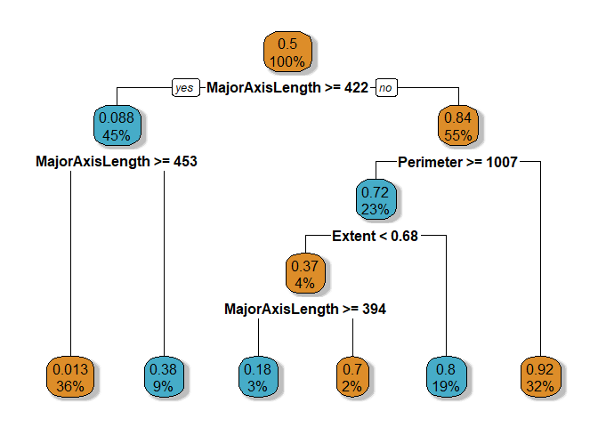<!-- -->

```r
#logistic by hand
logistic_test_predictions = predict(logistic, newdata = test)
mse(fitted(logistic), train, "Class") # 0.09080575 before <- 0.09835077 after 
```

```
## [1] 0.09080575
```

```r
mse(logistic_test_predictions, test, "Class")
```

```
## [1] 37.4428
```

```r
CDP_accuracy(logistic_test_predictions, test)
```

```
## [1] 0.8740741
```

```r
# 3. Logistic after diagnostic
logistic_ad = glm(Class ~ Perimeter + Eccentricity, data = train, family = binomial(link = 'logit'))
tidy(logistic_ad)
```

```
## # A tibble: 3 × 5
##   term         estimate std.error statistic  p.value
##   <chr>           <dbl>     <dbl>     <dbl>    <dbl>
## 1 (Intercept)   19.3      1.78        10.8  3.03e-27
## 2 Perimeter     -0.0124   0.00109    -11.4  5.86e-30
## 3 Eccentricity  -6.79     1.81        -3.76 1.72e- 4
```

```r
hist(fitted(logistic_ad))
```

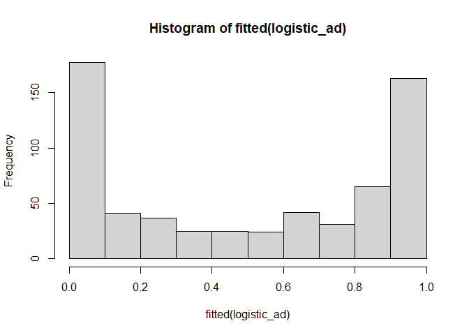<!-- -->

```r
#logistic by hand
logistic_ad_test_predictions = predict(logistic_ad, newdata = test)
mse(fitted(logistic_ad), train, "Class") # 0.09080575 before <- 0.09835077 after 
```

```
## [1] 0.09835077
```

```r
mse(logistic_ad_test_predictions, test, "Class")
```

```
## [1] 12.18564
```

```r
CDP_accuracy(logistic_ad_test_predictions, test)
```

```
## [1] 0.8481481
```

### 4. RIDGE


```r
library(glmnet)
X = model.matrix(Class~.-1, data = train)
y=train$Class
ridge=glmnet(X,y,alpha=0)
#ridge$beta
plot(ridge,xvar="lambda", label = TRUE) # Extent(4) and Eccentricity (6) are the variables kept
```

<!-- -->

```r
ridge_fitted = predict(ridge, newx = X) # fitted value for the training set using the best lambda value automatically selected by the function
ridge_predicted = predict(ridge, newx = model.matrix(Class~.-1, data = test)) # fitted value for the training set using the best lambda value automatically selected by the function
cv.ridge=cv.glmnet(X,y,alpha=0)
coef(cv.ridge)
```

```
## 8 x 1 sparse Matrix of class "dgCMatrix"
##                            s1
## (Intercept)      1.758196e+00
## Area            -1.264016e-06
## MajorAxisLength -5.706732e-04
## MinorAxisLength -8.626293e-04
## Eccentricity    -7.028762e-01
## ConvexArea      -1.137525e-06
## Extent           3.705386e-01
## Perimeter       -2.457501e-04
```

```r
plot(cv.ridge) # cv mse of the ridge
```

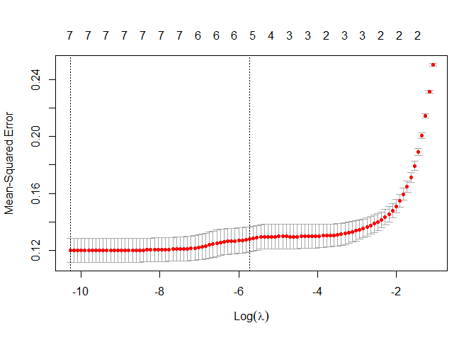<!-- -->

```r
cv.ridge_fitted = predict(cv.ridge, newx = X)
cv.ridge_predicted = predict(cv.ridge, newx = model.matrix(Class~.-1, data = test))
mse(ridge_fitted, train, "Class") # training error of the ridge
```

```
## [1] 0.25
```

```r
mse(ridge_predicted, test, "Class") # test error of the ridge
```

```
## [1] 0.25
```

```r
mse(cv.ridge_fitted, train, "Class") # cv test error of the ridge
```

```
## [1] 0.1321348
```

```r
mse(cv.ridge_predicted, test, "Class") # cv test error of the ridge
```

```
## [1] 0.1466852
```

```r
# Calculate accuracy
CDP_accuracy(cv.ridge_predicted, test)
```

```
## [1] 0.8444444
```

### 5. LASSO


```r
# Fit the lasso regression model
fit.lasso=glmnet(X,y)
# Plot the lasso coefficients
plot(fit.lasso,xvar="lambda",label=TRUE)
```

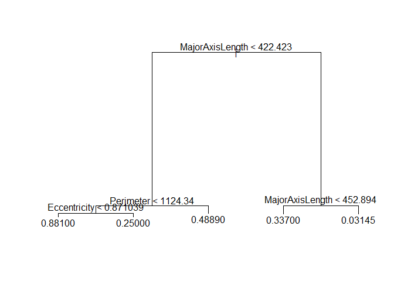<!-- -->

```r
# Perform cross-validation for lasso regression
cv.lasso=cv.glmnet(X,y)
# Extract the coefficients from cross-validation
plot(cv.lasso)
```

<!-- -->

```r
coef(cv.lasso) # variables kept are all but Extent
```

```
## 8 x 1 sparse Matrix of class "dgCMatrix"
##                            s1
## (Intercept)      3.170689e+00
## Area             .           
## MajorAxisLength  .           
## MinorAxisLength -2.365980e-03
## Eccentricity    -1.326980e+00
## ConvexArea       3.440799e-06
## Extent           4.621691e-02
## Perimeter       -1.181177e-03
```

```r
# Calculate mean squared error for the training data
cv.lasso_fitted = predict(cv.lasso, newx = X)
cv.lasso_predicted = predict(cv.lasso, newx = model.matrix(Class~.-1, data = test))
mse(cv.lasso_fitted, train, "Class") # train error of the lasso
```

```
## [1] 0.1246778
```

```r
mse(cv.lasso_predicted, test, "Class") # test error of the lasso
```

```
## [1] 0.1428101
```

```r
# Calculate accuracy
CDP_accuracy(cv.lasso_predicted, test)
```

```
## [1] 0.8555556
```

### 6. TREE


```r
library(tree)
library(rpart.plot)

# Fit the decision tree model
treeFit <- tree(Class ~ ., data = train)
summary(treeFit)
```

```
## 
## Regression tree:
## tree(formula = Class ~ ., data = train)
## Variables actually used in tree construction:
## [1] "MajorAxisLength" "Perimeter"       "Extent"         
## Number of terminal nodes:  6 
## Residual mean deviance:  0.08826 = 55.07 / 624 
## Distribution of residuals:
##     Min.  1st Qu.   Median     Mean  3rd Qu.     Max. 
## -0.92040 -0.01333  0.03313  0.00000  0.07960  0.98670
```

```r
# Convert the tree object to an rpart object
treeFit_rpart <- rpart(treeFit)

# Plot the decision tree using rpart.plot
rpart.plot(treeFit_rpart, box.col = c("#DD8D29", "#46ACC8"), shadow.col = "gray")
```

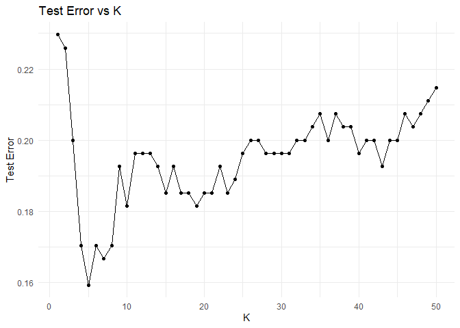<!-- -->


```r
raisins_shb = read.csv(
  "https://raw.githubusercontent.com/LeonardoAcquaroli/raisins_and_mushrooms/main/datasets/Raisin_Dataset.csv",
  sep = ";", stringsAsFactors = TRUE, header = TRUE)

# remove the Class column  
raisins_shb <- raisins_shb[,-9] 
colnames(raisins_shb)
```

```
## [1] "Area"            "MajorAxisLength" "MinorAxisLength" "Eccentricity"   
## [5] "ConvexArea"      "Extent"          "Perimeter"       "Class_literal"
```

```r
set.seed(42)
training_index_shb = createDataPartition(raisins_shb$Class_literal, p=0.7, list = FALSE) # index of the train set examples
train_shb = raisins_shb[training_index_shb,]
test_shb = raisins_shb[-training_index_shb,]

treeFit_rpart_shb <- rpart(formula = Class_literal  ~ . , data = train_shb)

# Plot the decision tree using rpart.plot
rpart.plot(treeFit_rpart_shb, box.col = c("#DD8D29", "#46ACC8"), shadow.col = "gray")
```

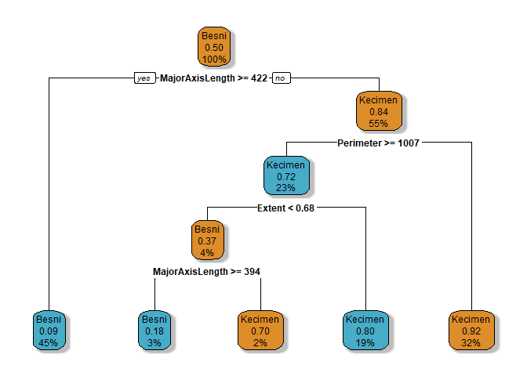<!-- -->


```r
#training prediction
tree_fitted <- predict(treeFit, newdata = train)

#test predictions
tree_predicted <- predict(treeFit, newdata = test)

mse(tree_fitted, train, "Class") # training error of the train
```

```
## [1] 0.08741554
```

```r
mse(tree_predicted, test, "Class") # test error of the test
```

```
## [1] 0.1213496
```

```r
# Calculate accuracy
CDP_accuracy(tree_predicted, test)
```

```
## [1] 0.8555556
```

```r
# This approach leads to correct predictions for around 85.55% of the raisins in the test data set.
# The best results achieved in the paper were 86.44% with a SVM
```

### 7. KNN


```r
# Scaling
train.array <- scale(train[, 1:7])
test.array<- scale(test[, 1:7])
# Labels
training_labels=train$Class
# KNN Model 
k_values <- 1:50
accuracy_scores <- numeric(length(k_values))

for (i in seq_along(k_values)) {
  #KNN model
  classifier_knn <- knn(train, test, cl = training_labels, k = k_values[i])
  
  # Convert to factors
  classifier_knn <- as.factor(classifier_knn)
  actual_labels <- as.factor(test$Class)
  
  #Accuracy
  cm <- confusionMatrix(classifier_knn, actual_labels)
  accuracy_scores[i] <- cm$overall["Accuracy"]
}

# Best K value 
best_k <- k_values[which.max(accuracy_scores)]

#print(paste("Accuracy scores:", accuracy_scores))
print(paste("Best K value:", best_k))
```

```
## [1] "Best K value: 5"
```

```r
#Data frame with K values and accuracy
k_values_results <- data.frame(K = k_values, Accuracy = accuracy_scores)
Knn_accuracy =  k_values_results[which.max(k_values_results$Accuracy),]
Knn_accuracy
```

```
##   K  Accuracy
## 5 5 0.8407407
```

```r
# Plot
ggplot(k_values_results, aes(x = K, y = 1 - Accuracy)) +
  geom_line() +
  geom_point() +
  labs(x = "K", y = "Test Error") +
  ggtitle("Test Error vs K") +
  theme_minimal()
```

<!-- -->

# Predictive power table


```r
mse_list = c(mse(ols_test_predictions,test, "Class"),
             mse(ols_robust_test_predictions,test, "Class"),
             mse(logistic_test_predictions, test, "Class"),
             mse(logistic_ad_test_predictions, test, "Class"),
             mse(cv.ridge_predicted, test, "Class"),
             mse(cv.lasso_predicted, test, "Class"),
             mse(tree_predicted, test, "Class"),
             NA)
accuracy_list = c(CDP_accuracy(ols_test_predictions, test),
                  CDP_accuracy(ols_robust_test_predictions, test),
                  CDP_accuracy(logistic_test_predictions, test),
                  CDP_accuracy(logistic_ad_test_predictions, test),
                  CDP_accuracy(cv.ridge_predicted, test),
                  CDP_accuracy(cv.lasso_predicted, test),
                  CDP_accuracy(tree_predicted, test),
                  Knn_accuracy$Accuracy)

sumupDF = data.frame(Test_mse = mse_list, Accuracy = accuracy_list,
                     row.names = c("OLS", "Robust OLS", "Logistic", "Logistic (after diagnostics)","Ridge", "Lasso", "Tree", "K-NN"))
sumupDF
```

```
##                                Test_mse  Accuracy
## OLS                           0.1453523 0.8555556
## Robust OLS                    0.1356805 0.8481481
## Logistic                     37.4428017 0.8740741
## Logistic (after diagnostics) 12.1856431 0.8481481
## Ridge                         0.1466852 0.8444444
## Lasso                         0.1428101 0.8555556
## Tree                          0.1213496 0.8555556
## K-NN                                 NA 0.8407407
```

Our logistic model actually beats the SVM approach that achieved the best performance in the paper.

# Unsupervised models

### 1.PCA


```r
df = raisins[-c(8, 9)]
```


```r
options(scipen = 10)
round((apply(df, 2, mean)), digits = 5); round((apply(df, 2, var)), digits = 5)
```

```
##            Area MajorAxisLength MinorAxisLength    Eccentricity      ConvexArea 
##     87804.12778       430.92995       254.48813         0.78154     91186.09000 
##          Extent       Perimeter 
##         0.69951      1165.90664
```

```
##             Area  MajorAxisLength  MinorAxisLength     Eccentricity 
## 1521164692.88354      13464.14922       2498.89029          0.00816 
##       ConvexArea           Extent        Perimeter 
## 1662135017.86620          0.00286      74946.90040
```


```r
summary(df)
```

```
##       Area        MajorAxisLength MinorAxisLength  Eccentricity   
##  Min.   : 25387   Min.   :225.6   Min.   :143.7   Min.   :0.3487  
##  1st Qu.: 59348   1st Qu.:345.4   1st Qu.:219.1   1st Qu.:0.7418  
##  Median : 78902   Median :407.8   Median :247.8   Median :0.7988  
##  Mean   : 87804   Mean   :430.9   Mean   :254.5   Mean   :0.7815  
##  3rd Qu.:105028   3rd Qu.:494.2   3rd Qu.:279.9   3rd Qu.:0.8426  
##  Max.   :235047   Max.   :997.3   Max.   :492.3   Max.   :0.9621  
##    ConvexArea         Extent         Perimeter     
##  Min.   : 26139   Min.   :0.3799   Min.   : 619.1  
##  1st Qu.: 61513   1st Qu.:0.6709   1st Qu.: 966.4  
##  Median : 81651   Median :0.7074   Median :1119.5  
##  Mean   : 91186   Mean   :0.6995   Mean   :1165.9  
##  3rd Qu.:108376   3rd Qu.:0.7350   3rd Qu.:1308.4  
##  Max.   :278217   Max.   :0.8355   Max.   :2697.8
```


```r
#correlazione di ogni variabile con ogni componente
pr.out = prcomp(df, scale = TRUE)
pr.out
```

```
## Standard deviations (1, .., p=7):
## [1] 2.19824671 1.20548266 0.79274805 0.23837893 0.14767623 0.08018847 0.03178852
## 
## Rotation (n x k) = (7 x 7):
##                         PC1         PC2          PC3        PC4         PC5
## Area             0.44828422 -0.11609991  0.005483783 -0.1111391 -0.61104765
## MajorAxisLength  0.44323980  0.13658724 -0.100547975  0.4952046  0.08757032
## MinorAxisLength  0.38938118 -0.37492246  0.236043538 -0.6558767  0.38457775
## Eccentricity     0.20297098  0.61082321 -0.628522057 -0.4262986  0.07510412
## ConvexArea       0.45093833 -0.08761633  0.036672403  0.0558117 -0.39241075
## Extent          -0.05636836 -0.66734439 -0.731980930  0.1090526  0.05685884
## Perimeter        0.45082374  0.03417227  0.044300766  0.3398651  0.55515080
##                         PC6         PC7
## Area             0.09983439  0.62436686
## MajorAxisLength  0.68557712 -0.22772863
## MinorAxisLength  0.23903320 -0.12995283
## Eccentricity    -0.05356014 -0.02044403
## ConvexArea      -0.47120104 -0.63914127
## Extent          -0.02345199  0.00161639
## Perimeter       -0.48726906  0.36399975
```


```r
summary(pr.out)
```

```
## Importance of components:
##                           PC1    PC2     PC3     PC4     PC5     PC6     PC7
## Standard deviation     2.1982 1.2055 0.79275 0.23838 0.14768 0.08019 0.03179
## Proportion of Variance 0.6903 0.2076 0.08978 0.00812 0.00312 0.00092 0.00014
## Cumulative Proportion  0.6903 0.8979 0.98770 0.99582 0.99894 0.99986 1.00000
```


```r
fviz_eig(pr.out, addlabels = TRUE, ylim = c(0, 70), main = "Scree Plot of PCA")
```

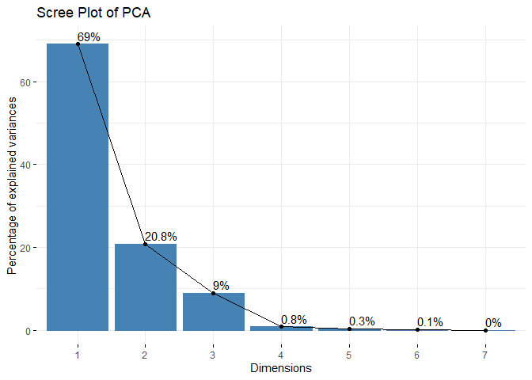<!-- -->

```r
fviz_pca_var(pr.out, col.var = "blue", col.quanti.sup = "red", 
             addlabels = TRUE, repel = TRUE)
```

<!-- -->


```r
plot(pr.out$x[, 1], pr.out$x[, 2], type = "n", xlab = "PC1", ylab = "PC2") 
points(pr.out$x[, 1], pr.out$x[, 2], col = rgb(1, 0, 0, alpha = 0.5), pch = 16)  
arrows(0, 0, pr.out$rotation[, 1]*7, pr.out$rotation[, 2]*7, length = 0.1, angle = 30)
text(pr.out$rotation[, 1]*7, pr.out$rotation[, 2]*7, labels = rownames(pr.out[[2]]), pos = 3)
```

<!-- -->


```r
pcadf <- predict(pr.out, newdata = df)

head(pcadf)
```

```
##              PC1        PC2        PC3         PC4         PC5         PC6
## [1,]  0.07695107 -0.4530762 -1.0886089  0.02677384  0.14130792 -0.01305046
## [2,] -0.47511173  0.4451209  0.0163634 -0.11588016  0.12192770 -0.01380135
## [3,]  0.37190213  0.8015625  0.7860500 -0.26481536  0.06215554  0.04339440
## [4,] -2.62098767 -0.3023955  0.4824528  0.09954147 -0.11526674 -0.04226070
## [5,] -0.96151922 -2.9661138  0.4519030  0.29971631  0.17567361  0.05243930
## [6,] -2.17195550  0.9238982  0.3449905 -0.12934240 -0.13916468 -0.03884966
##               PC7
## [1,]  0.003705580
## [2,]  0.005668952
## [3,]  0.007204504
## [4,]  0.013379086
## [5,]  0.006945311
## [6,] -0.008369549
```

### 2.Clustering su tutte le variabili


```r
km.out = kmeans(df, 2)

km.out
```

```
## K-means clustering with 2 clusters of sizes 711, 189
## 
## Cluster means:
##        Area MajorAxisLength MinorAxisLength Eccentricity ConvexArea    Extent
## 1  71209.01        384.5485        236.4324    0.7677608   73877.08 0.7008132
## 2 150233.37        605.4126        322.4120    0.8333862  156300.93 0.6945978
##   Perimeter
## 1  1055.006
## 2  1583.103
## 
## Clustering vector:
##   [1] 1 1 1 1 1 1 1 1 1 1 1 1 1 1 1 1 1 1 1 1 1 1 1 1 1 1 1 1 1 1 1 1 1 1 1 1 1
##  [38] 1 1 1 1 1 1 1 1 1 1 1 1 1 1 2 1 1 1 1 1 1 1 1 1 1 1 1 1 1 1 1 1 1 1 1 1 1
##  [75] 1 1 1 1 1 1 1 1 1 1 1 2 1 1 1 1 1 1 1 1 1 1 1 1 1 1 1 1 1 1 1 1 1 1 1 1 1
## [112] 1 1 1 1 1 1 1 1 1 1 1 1 1 1 1 1 1 1 1 1 1 1 1 1 1 1 1 1 1 1 1 1 1 1 1 1 1
## [149] 1 1 1 1 1 1 1 1 1 1 1 1 1 1 1 1 1 1 1 1 1 1 1 1 1 1 1 1 1 1 1 1 1 1 1 1 1
## [186] 1 1 1 1 1 1 1 1 1 1 1 1 1 1 1 1 1 1 1 1 1 1 1 1 1 1 1 1 1 1 1 1 1 1 1 1 1
## [223] 1 1 1 1 1 1 1 1 1 1 1 1 1 1 1 1 1 1 1 1 1 1 1 1 1 1 1 1 1 1 1 1 1 1 1 1 1
## [260] 1 1 1 1 1 1 1 1 1 1 1 1 1 1 1 1 1 1 1 1 1 1 1 1 1 1 1 1 1 1 1 2 1 1 1 1 1
## [297] 1 1 1 1 1 1 1 1 1 1 1 1 1 1 1 1 1 1 1 1 1 1 1 1 1 1 1 1 1 1 1 1 1 1 1 1 1
## [334] 1 1 1 1 1 1 1 1 1 1 1 1 1 1 1 1 1 1 1 1 1 1 1 1 1 1 1 1 1 1 1 1 1 1 1 1 1
## [371] 1 1 1 1 1 1 1 1 1 1 1 1 1 1 1 1 1 1 1 1 1 1 1 1 1 1 1 1 1 1 1 1 1 1 1 1 1
## [408] 1 1 1 1 1 1 1 1 1 1 1 1 1 1 1 1 1 1 1 1 1 1 1 1 1 1 1 1 1 1 1 1 1 1 1 1 1
## [445] 1 1 1 1 1 1 2 2 1 1 1 2 2 2 2 1 1 1 2 1 2 1 1 2 2 2 1 2 1 2 1 2 2 1 2 2 2
## [482] 1 2 1 2 1 1 2 1 1 2 1 1 1 1 2 2 1 2 1 2 2 1 2 1 1 2 2 2 2 1 1 1 1 2 2 2 1
## [519] 1 1 2 1 2 2 1 2 1 2 2 1 1 1 1 2 2 1 1 1 2 1 2 2 2 2 1 1 1 2 2 1 1 1 2 1 1
## [556] 2 1 1 1 2 2 2 1 2 1 2 2 2 2 1 1 1 1 2 2 2 1 2 2 2 2 2 2 2 1 1 2 1 2 1 2 1
## [593] 2 2 2 1 1 1 1 2 1 2 1 2 1 2 1 1 1 2 1 1 2 2 1 1 2 2 1 1 1 2 2 2 1 1 1 1 1
## [630] 1 1 1 1 1 2 1 1 2 1 1 1 2 1 1 2 2 1 1 1 2 2 1 1 1 2 1 2 2 1 1 1 2 1 1 1 1
## [667] 2 1 2 1 2 2 1 1 1 2 1 2 2 2 1 2 1 1 1 1 1 2 1 1 1 2 2 1 2 1 1 1 1 2 2 2 2
## [704] 2 2 1 1 1 2 1 1 2 1 1 1 1 1 1 1 1 1 1 2 1 1 1 1 2 1 1 1 1 1 1 1 2 2 1 2 1
## [741] 1 2 1 1 1 1 2 2 1 1 1 2 1 1 2 2 2 1 1 2 2 1 1 1 1 2 1 2 2 2 2 2 1 1 1 1 2
## [778] 2 2 1 1 2 1 1 1 1 2 1 2 1 1 2 1 1 1 1 1 1 1 1 2 2 1 2 2 1 2 1 1 1 2 1 2 2
## [815] 1 2 1 1 1 1 2 2 1 1 1 1 1 1 1 2 2 1 1 1 2 1 2 2 1 1 1 1 1 1 1 2 1 2 1 1 1
## [852] 1 1 2 1 2 2 2 1 2 2 1 1 1 2 2 2 1 2 1 2 1 1 1 1 1 2 2 2 1 2 2 1 2 1 1 2 1
## [889] 1 1 1 1 2 2 2 1 1 1 1 1
## 
## Within cluster sum of squares by cluster:
## [1] 569761126243 345272914401
##  (between_SS / total_SS =  68.0 %)
## 
## Available components:
## 
## [1] "cluster"      "centers"      "totss"        "withinss"     "tot.withinss"
## [6] "betweenss"    "size"         "iter"         "ifault"
```


```r
#Since clusters do not correspond to a specific category, we cannot estimate accuracy. 
#However, distribution should be 450-450, but it is 189-711, so the algorithm is clearly not adequate for this dataset.
plot (df, col = adjustcolor(km.out$cluster + 1, alpha.f = 0.1),
main = "K- Means Clustering Results with K = 2", pch = 20)
```

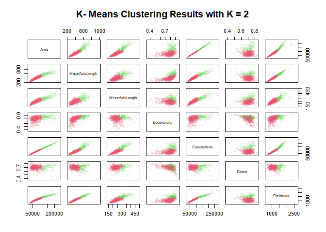<!-- -->

### 3. Clustering su PCA


```r
#Perform 2-means clustering on the components' values for each observation
km.out2 = kmeans(pcadf, 2)
km.out2
```

```
## K-means clustering with 2 clusters of sizes 649, 251
## 
## Cluster means:
##         PC1         PC2         PC3          PC4         PC5           PC6
## 1 -1.115798  0.01818142  0.01584812 -0.005973334  0.01022919 -0.0007964852
## 2  2.885072 -0.04701092 -0.04097781  0.015444995 -0.02644917  0.0020594378
##            PC7
## 1 -0.001688230
## 2  0.004365184
## 
## Clustering vector:
##   [1] 1 1 1 1 1 1 1 1 1 1 1 1 1 1 1 1 1 1 1 1 1 1 1 1 1 1 1 1 1 1 1 1 1 1 1 1 1
##  [38] 1 1 1 1 1 1 1 1 1 1 1 1 1 1 2 1 1 2 1 1 1 1 1 1 1 1 1 1 1 1 1 1 1 1 1 1 1
##  [75] 1 1 1 1 1 1 1 1 1 1 1 2 1 1 1 1 1 1 1 1 1 1 1 1 1 1 1 1 1 1 1 1 1 1 1 1 1
## [112] 1 1 1 1 1 1 1 1 1 1 1 1 1 1 1 1 1 1 1 1 1 1 1 1 1 1 1 1 2 1 1 1 1 1 1 1 1
## [149] 1 1 1 1 1 1 1 1 1 1 1 1 1 1 1 1 1 1 1 1 1 1 1 1 1 1 1 1 1 1 1 1 1 1 1 1 1
## [186] 1 1 1 1 1 1 1 1 1 1 1 1 1 1 1 1 1 1 1 1 1 1 1 1 1 1 1 1 1 1 1 1 1 1 1 1 1
## [223] 1 1 1 1 1 1 1 1 1 1 1 1 1 1 1 1 1 1 1 1 1 1 1 1 1 1 1 1 1 1 1 1 1 1 1 1 1
## [260] 1 1 1 1 1 1 1 1 1 1 1 1 1 1 1 1 1 1 1 1 1 1 1 1 1 1 1 1 1 1 1 2 1 1 1 1 1
## [297] 1 1 1 1 1 1 1 1 1 1 1 1 1 1 1 1 1 1 1 1 1 1 1 1 1 1 1 1 1 1 1 1 1 1 1 1 1
## [334] 1 1 1 1 1 1 1 1 1 1 1 1 1 1 1 1 1 1 1 1 1 1 1 1 1 1 1 1 1 1 1 1 1 1 1 1 1
## [371] 1 1 1 1 1 1 1 1 1 1 1 1 1 1 1 1 1 1 1 1 1 1 1 1 1 1 1 1 1 1 1 1 1 1 1 1 1
## [408] 1 1 1 1 1 1 1 1 1 1 1 1 1 1 1 1 1 1 1 1 1 1 1 1 1 1 1 1 1 1 1 1 1 1 1 1 1
## [445] 1 1 1 1 1 1 2 2 1 1 1 2 2 2 2 1 2 1 2 1 2 1 2 2 2 2 1 2 2 2 1 2 2 2 2 2 2
## [482] 1 2 1 2 1 2 2 1 1 2 1 1 1 1 2 2 1 2 2 2 2 1 2 1 2 2 2 2 2 1 1 1 1 2 2 2 1
## [519] 1 1 2 1 2 2 1 2 1 2 2 1 1 2 1 2 2 1 1 1 2 2 2 2 2 2 2 1 1 2 2 1 1 1 2 1 1
## [556] 2 1 1 1 2 2 2 1 2 2 2 2 2 2 1 2 1 1 2 2 2 2 2 2 2 2 2 2 2 2 1 2 1 2 2 2 2
## [593] 2 2 2 1 1 2 1 2 1 2 1 2 1 2 1 1 2 2 1 1 2 2 1 2 2 2 2 2 1 2 2 2 1 1 2 2 2
## [630] 1 1 1 1 1 2 1 2 2 2 1 1 2 1 2 2 2 1 1 1 2 2 2 1 1 2 1 2 2 1 1 1 2 1 1 2 1
## [667] 2 2 2 1 2 2 1 2 1 2 1 2 2 2 1 2 2 1 1 1 1 2 1 1 1 2 2 1 2 1 1 1 1 2 2 2 2
## [704] 2 2 1 1 1 2 2 1 2 1 2 1 1 2 1 1 2 1 1 2 1 1 1 1 2 1 1 1 1 2 2 1 2 2 1 2 1
## [741] 2 2 2 2 1 1 2 2 1 1 2 2 1 1 2 2 2 1 1 2 2 1 2 2 1 2 1 2 2 2 2 2 1 2 1 1 2
## [778] 2 2 2 1 2 1 2 1 1 2 2 2 1 2 2 1 1 2 1 1 1 1 1 2 2 1 2 2 1 2 1 1 2 2 1 2 2
## [815] 1 2 1 1 1 1 2 2 1 2 2 1 1 1 1 2 2 1 1 1 2 1 2 2 1 1 1 1 2 1 1 2 1 2 1 1 2
## [852] 1 1 2 1 2 2 2 1 2 2 1 2 1 2 2 2 1 2 1 2 2 1 1 1 1 2 2 2 1 2 2 2 2 2 1 2 1
## [889] 1 1 1 2 2 2 2 1 1 1 1 1
## 
## Within cluster sum of squares by cluster:
## [1] 2038.821 1355.248
##  (between_SS / total_SS =  46.1 %)
## 
## Available components:
## 
## [1] "cluster"      "centers"      "totss"        "withinss"     "tot.withinss"
## [6] "betweenss"    "size"         "iter"         "ifault"
```


```r
#Graphical representation of the clusters. 
#Results are slightly better on PC than on initial features
plot (pcadf, col = adjustcolor(km.out2$cluster + 1, alpha.f = 0.5),
main = "K- Means Clustering Results with K = 2", pch = 20)
```

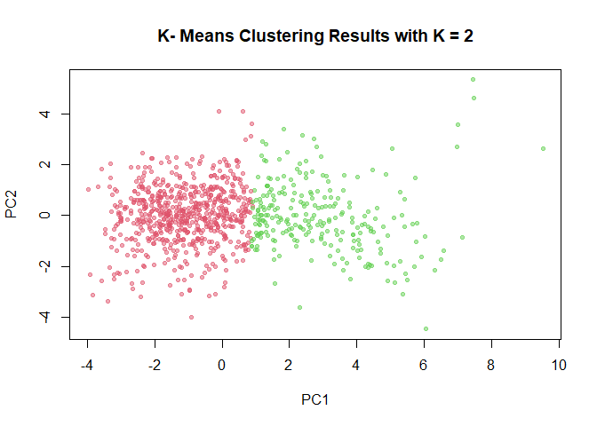<!-- -->
