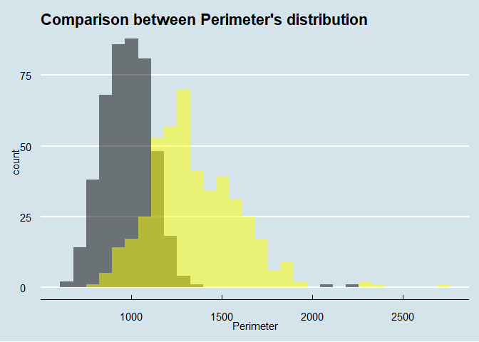
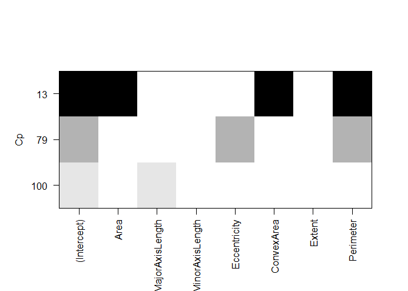
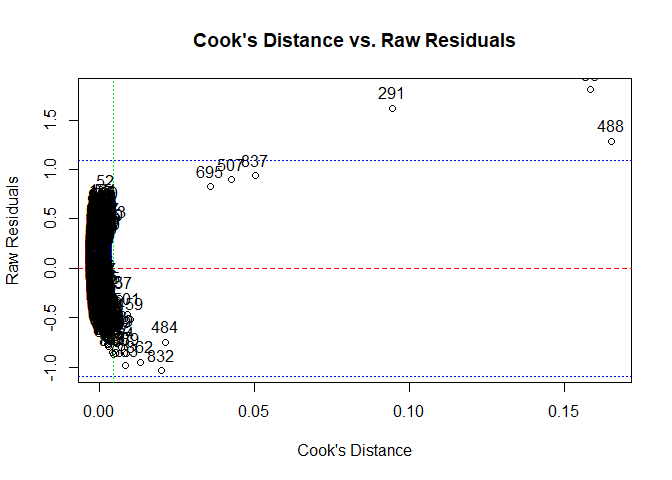

# Description

Raisins can be of two species: *Kecimen* and *Besni*.\
We built different models to predict the species on the basis of the dimensions of the raisin example approximated as an ellipse.

## Variables

The predictors that can be used are:

-   Area MajorAxisLength
-   MinorAxisLength
-   Eccentricity
-   ConvexArea
-   Extent
-   Perimeter
-   Class_literal

# Descriptive Analysis

#### Loading Libraries


```r
library(ggplot2)
library(dplyr)
library(tidyverse)
library(tidymodels)
library(glmnet)
library(estimatr)
library(stats)
library(maxLik)
library(Matrix)
library(caret)
library(performance)
library(see)
library(corrplot)
library(GGally)
library(car)
library(FactoMineR)
library(factoextra)
```

#### Loading data-set

(Aim: visualize dataset, summary, remove Class_literal)


```r
raisins = read.csv(
  "https://raw.githubusercontent.com/LeonardoAcquaroli/raisins_and_mushrooms/main/datasets/Raisin_Dataset.csv",
  sep = ";"
)

head(raisins)
```

```
##    Area MajorAxisLength MinorAxisLength Eccentricity ConvexArea    Extent
## 1 87524        442.2460        253.2912    0.8197384      90546 0.7586506
## 2 75166        406.6907        243.0324    0.8018052      78789 0.6841296
## 3 90856        442.2670        266.3283    0.7983536      93717 0.6376128
## 4 45928        286.5406        208.7600    0.6849892      47336 0.6995994
## 5 79408        352.1908        290.8275    0.5640113      81463 0.7927719
## 6 49242        318.1254        200.1221    0.7773513      51368 0.6584564
##   Perimeter Class_literal Class
## 1  1184.040       Kecimen     1
## 2  1121.786       Kecimen     1
## 3  1208.575       Kecimen     1
## 4   844.162       Kecimen     1
## 5  1073.251       Kecimen     1
## 6   881.836       Kecimen     1
```

```r
# remove the Class_literal  column  
raisins_corr <- raisins
raisins <- raisins[,-8] 
# Class: 1 if raisin is of Kecimen type, 0 if it is Besni
```

### Correlations plots

(Aim: visually represent relationships between variables)

<!-- --><!-- --><!-- -->

### Boxplot

(Aim: Identify outliers)

<!-- --><!-- --><!-- --><!-- --><!-- --><!-- --><!-- --><!-- -->

### Histograms highlighting class differences

(Aim: See more clearly if variables' distribution depend on Class)


```r
library(ggthemes)
```

<!-- --><!-- --><!-- --><!-- --><!-- --><!-- -->

# Supervised models

#### Splitting train and test test


```r
library(caret)

set.seed(42)
training_index = createDataPartition(raisins$Class, p=0.7, list = FALSE) # index of the train set examples
train = raisins[training_index,]
test = raisins[-training_index,]
```

#### MSE Function

(Aim: to evaluate the performance of predictive models)


```r
mse = function(predictions,data,y){
  residuals = (predictions - (data[c(y)]))
  mse = (1/nrow(data))*sum((residuals^2))
  return(mse)
}
```

## MODELS

### 1. OLS


```r
# Fit the linear regression model
ols = lm("Class ~ .",data=train)
# Summary of the model
print(summary(ols))
```

```
## 
## Call:
## lm(formula = "Class ~ .", data = train)
## 
## Residuals:
##      Min       1Q   Median       3Q      Max 
## -1.14592 -0.23372  0.01838  0.25465  0.69993 
## 
## Coefficients:
##                   Estimate Std. Error t value Pr(>|t|)    
## (Intercept)      3.690e+00  4.534e-01   8.139 2.18e-15 ***
## Area            -3.371e-05  6.771e-06  -4.978 8.31e-07 ***
## MajorAxisLength  2.259e-03  1.311e-03   1.723   0.0854 .  
## MinorAxisLength  5.358e-05  1.732e-03   0.031   0.9753    
## Eccentricity    -8.676e-01  3.385e-01  -2.563   0.0106 *  
## ConvexArea       4.475e-05  6.781e-06   6.599 8.89e-11 ***
## Extent           8.826e-03  3.186e-01   0.028   0.9779    
## Perimeter       -3.969e-03  6.719e-04  -5.907 5.73e-09 ***
## ---
## Signif. codes:  0 '***' 0.001 '**' 0.01 '*' 0.05 '.' 0.1 ' ' 1
## 
## Residual standard error: 0.3445 on 622 degrees of freedom
## Multiple R-squared:  0.5313,	Adjusted R-squared:  0.526 
## F-statistic: 100.7 on 7 and 622 DF,  p-value: < 2.2e-16
```


```r
# Predictions on the test data
ols_test_predictions = predict.lm(ols,newdata = test)
# Histogram of the fitted values
hist(fitted(ols))
```

<!-- -->

```r
# Calculate MSE for the training data
mse_train<-mse(fitted(ols), train, "Class") #training error
mse_train
```

```
## [1] 0.1171742
```

```r
# Calculate MSE for the test data
mse_test<-mse(ols_test_predictions,test,"Class") #test error
mse_test
```

```
## [1] 0.1346953
```

### 2. ROBUST OLS


```r
library(sandwich)
library(lmtest)
library(MASS)

# Fit the robust linear regression model
ols_robust = rlm(Class ~ ., data = train, se_type = "HC2")
# Summary of the robust model
summary(ols_robust)
```

```
## 
## Call: rlm(formula = Class ~ ., data = train, se_type = "HC2")
## Residuals:
##      Min       1Q   Median       3Q      Max 
## -1.19202 -0.24001  0.01411  0.23545  0.70461 
## 
## Coefficients:
##                 Value   Std. Error t value
## (Intercept)      3.8754  0.4719     8.2122
## Area             0.0000  0.0000    -5.1532
## MajorAxisLength  0.0022  0.0014     1.6373
## MinorAxisLength -0.0002  0.0018    -0.1314
## Eccentricity    -0.8842  0.3523    -2.5096
## ConvexArea       0.0000  0.0000     6.9109
## Extent           0.0672  0.3316     0.2028
## Perimeter       -0.0042  0.0007    -5.9900
## 
## Residual standard error: 0.3521 on 622 degrees of freedom
```

```r
# Predictions on the test data
ols_robust_test_predictions = predict(ols_robust, newdata = test)
# Histogram of the fitted values
hist(fitted(ols_robust))
```

<!-- -->

```r
# Calculate MSE for the training data
mse(fitted(ols_robust), train, "Class") #training error
```

```
## [1] 0.1175795
```

```r
# Calculate MSE for the test data
mse(ols_robust_test_predictions, test, "Class") #test error
```

```
## [1] 0.1356805
```

### 3. LOGISTIC


```r
library(broom)

# 3. Logistic
logistic = glm(Class ~ ., data = train, family = binomial(link = 'logit'))
tidy(logistic)
```

```
## # A tibble: 8 × 5
##   term              estimate std.error statistic p.value
##   <chr>                <dbl>     <dbl>     <dbl>   <dbl>
## 1 (Intercept)     -13.3       8.67       -1.54   0.124  
## 2 Area              0.000473  0.000228    2.08   0.0377 
## 3 MajorAxisLength   0.0184    0.0222      0.831  0.406  
## 4 MinorAxisLength   0.113     0.0355      3.18   0.00147
## 5 Eccentricity     12.1       5.07        2.40   0.0166 
## 6 ConvexArea       -0.000706  0.000226   -3.12   0.00179
## 7 Extent           -0.135     3.55       -0.0381 0.970  
## 8 Perimeter        -0.0100    0.00926    -1.09   0.278
```

```r
hist(fitted(logistic))
```

<!-- -->

```r
#logistic by hand
logistic_test_predictions = predict(logistic, newdata = test)
mse(fitted(logistic), train, "Class")
```

```
## [1] 0.09080575
```

```r
mse(logistic_test_predictions, test, "Class")
```

```
## [1] 37.4428
```

### 4. RIDGE

<!-- -->

```
## 8 x 1 sparse Matrix of class "dgCMatrix"
##                            s1
## (Intercept)      1.758196e+00
## Area            -1.264016e-06
## MajorAxisLength -5.706732e-04
## MinorAxisLength -8.626293e-04
## Eccentricity    -7.028762e-01
## ConvexArea      -1.137525e-06
## Extent           3.705386e-01
## Perimeter       -2.457501e-04
```

<!-- -->

```
## [1] 0.25
```

```
## [1] 0.25
```

```
## [1] 0.3101069
```

### 5. LASSO

<!-- --><!-- -->

```
## 8 x 1 sparse Matrix of class "dgCMatrix"
##                            s1
## (Intercept)      3.170689e+00
## Area             .           
## MajorAxisLength  .           
## MinorAxisLength -2.365980e-03
## Eccentricity    -1.326980e+00
## ConvexArea       3.440799e-06
## Extent           4.621691e-02
## Perimeter       -1.181177e-03
```

### 6. TREE

<!-- -->

# Unsupervised models

### 1.PCA


```r
df = raisins[-c(8, 9)]
```


```r
options(scipen = 10)
round((apply(df, 2, mean)), digits = 5); round((apply(df, 2, var)), digits = 5)
```

```
##            Area MajorAxisLength MinorAxisLength    Eccentricity      ConvexArea 
##     87804.12778       430.92995       254.48813         0.78154     91186.09000 
##          Extent       Perimeter 
##         0.69951      1165.90664
```

```
##             Area  MajorAxisLength  MinorAxisLength     Eccentricity 
## 1521164692.88354      13464.14922       2498.89029          0.00816 
##       ConvexArea           Extent        Perimeter 
## 1662135017.86620          0.00286      74946.90040
```


```r
summary(df)
```

```
##       Area        MajorAxisLength MinorAxisLength  Eccentricity   
##  Min.   : 25387   Min.   :225.6   Min.   :143.7   Min.   :0.3487  
##  1st Qu.: 59348   1st Qu.:345.4   1st Qu.:219.1   1st Qu.:0.7418  
##  Median : 78902   Median :407.8   Median :247.8   Median :0.7988  
##  Mean   : 87804   Mean   :430.9   Mean   :254.5   Mean   :0.7815  
##  3rd Qu.:105028   3rd Qu.:494.2   3rd Qu.:279.9   3rd Qu.:0.8426  
##  Max.   :235047   Max.   :997.3   Max.   :492.3   Max.   :0.9621  
##    ConvexArea         Extent         Perimeter     
##  Min.   : 26139   Min.   :0.3799   Min.   : 619.1  
##  1st Qu.: 61513   1st Qu.:0.6709   1st Qu.: 966.4  
##  Median : 81651   Median :0.7074   Median :1119.5  
##  Mean   : 91186   Mean   :0.6995   Mean   :1165.9  
##  3rd Qu.:108376   3rd Qu.:0.7350   3rd Qu.:1308.4  
##  Max.   :278217   Max.   :0.8355   Max.   :2697.8
```


```r
#correlazione di ogni variabile con ogni componente
pr.out = prcomp(df, scale = TRUE)
pr.out
```

```
## Standard deviations (1, .., p=7):
## [1] 2.19824671 1.20548266 0.79274805 0.23837893 0.14767623 0.08018847 0.03178852
## 
## Rotation (n x k) = (7 x 7):
##                         PC1         PC2          PC3        PC4         PC5
## Area             0.44828422 -0.11609991  0.005483783 -0.1111391 -0.61104765
## MajorAxisLength  0.44323980  0.13658724 -0.100547975  0.4952046  0.08757032
## MinorAxisLength  0.38938118 -0.37492246  0.236043538 -0.6558767  0.38457775
## Eccentricity     0.20297098  0.61082321 -0.628522057 -0.4262986  0.07510412
## ConvexArea       0.45093833 -0.08761633  0.036672403  0.0558117 -0.39241075
## Extent          -0.05636836 -0.66734439 -0.731980930  0.1090526  0.05685884
## Perimeter        0.45082374  0.03417227  0.044300766  0.3398651  0.55515080
##                         PC6         PC7
## Area             0.09983439  0.62436686
## MajorAxisLength  0.68557712 -0.22772863
## MinorAxisLength  0.23903320 -0.12995283
## Eccentricity    -0.05356014 -0.02044403
## ConvexArea      -0.47120104 -0.63914127
## Extent          -0.02345199  0.00161639
## Perimeter       -0.48726906  0.36399975
```


```r
summary(pr.out)
```

```
## Importance of components:
##                           PC1    PC2     PC3     PC4     PC5     PC6     PC7
## Standard deviation     2.1982 1.2055 0.79275 0.23838 0.14768 0.08019 0.03179
## Proportion of Variance 0.6903 0.2076 0.08978 0.00812 0.00312 0.00092 0.00014
## Cumulative Proportion  0.6903 0.8979 0.98770 0.99582 0.99894 0.99986 1.00000
```


```r
fviz_eig(pr.out, addlabels = TRUE, ylim = c(0, 70), main = "Scree Plot of PCA")
```

<!-- -->

```r
fviz_pca_var(pr.out, col.var = "blue", col.quanti.sup = "red", 
             addlabels = TRUE, repel = TRUE)
```

<!-- -->


```r
#Correct dimensions, show clearly the points but it is not readable

#plot(pr.out$x[, 1], pr.out$x[, 2], type = "n", xlab = "PC1", ylab = "PC2")  
#points(pr.out$x[, 1], pr.out$x[, 2], col = rgb(1, 0, 0, alpha = 0.5), pch = 16) 
#arrows(0, 0, pr.out$rotation[, 1], pr.out$rotation[, 2], length = 0.1, angle = 30)
```


```r
#Shows both the dimension and the arrows' label, but not the points
biplot(pr.out)
```

<!-- -->


```r
#Compromise, arrows length increased

plot(pr.out$x[, 1], pr.out$x[, 2], type = "n", xlab = "PC1", ylab = "PC2") 
points(pr.out$x[, 1], pr.out$x[, 2], col = rgb(1, 0, 0, alpha = 0.5), pch = 16)  
arrows(0, 0, pr.out$rotation[, 1]*7, pr.out$rotation[, 2]*7, length = 0.1, angle = 30)
text(pr.out$rotation[, 1]*7, pr.out$rotation[, 2]*7, labels = rownames(pr.out[[2]]), pos = 3)
```

<!-- -->


```r
pcadf <- predict(pr.out, newdata = df)

head(pcadf)
```

```
##              PC1        PC2        PC3         PC4         PC5         PC6
## [1,]  0.07695107 -0.4530762 -1.0886089  0.02677384  0.14130792 -0.01305046
## [2,] -0.47511173  0.4451209  0.0163634 -0.11588016  0.12192770 -0.01380135
## [3,]  0.37190213  0.8015625  0.7860500 -0.26481536  0.06215554  0.04339440
## [4,] -2.62098767 -0.3023955  0.4824528  0.09954147 -0.11526674 -0.04226070
## [5,] -0.96151922 -2.9661138  0.4519030  0.29971631  0.17567361  0.05243930
## [6,] -2.17195550  0.9238982  0.3449905 -0.12934240 -0.13916468 -0.03884966
##               PC7
## [1,]  0.003705580
## [2,]  0.005668952
## [3,]  0.007204504
## [4,]  0.013379086
## [5,]  0.006945311
## [6,] -0.008369549
```

### 2.Clustering su tutte le variabili


```r
km.out = kmeans(df, 2)

km.out
```

```
## K-means clustering with 2 clusters of sizes 711, 189
## 
## Cluster means:
##        Area MajorAxisLength MinorAxisLength Eccentricity ConvexArea    Extent
## 1  71209.01        384.5485        236.4324    0.7677608   73877.08 0.7008132
## 2 150233.37        605.4126        322.4120    0.8333862  156300.93 0.6945978
##   Perimeter
## 1  1055.006
## 2  1583.103
## 
## Clustering vector:
##   [1] 1 1 1 1 1 1 1 1 1 1 1 1 1 1 1 1 1 1 1 1 1 1 1 1 1 1 1 1 1 1 1 1 1 1 1 1 1
##  [38] 1 1 1 1 1 1 1 1 1 1 1 1 1 1 2 1 1 1 1 1 1 1 1 1 1 1 1 1 1 1 1 1 1 1 1 1 1
##  [75] 1 1 1 1 1 1 1 1 1 1 1 2 1 1 1 1 1 1 1 1 1 1 1 1 1 1 1 1 1 1 1 1 1 1 1 1 1
## [112] 1 1 1 1 1 1 1 1 1 1 1 1 1 1 1 1 1 1 1 1 1 1 1 1 1 1 1 1 1 1 1 1 1 1 1 1 1
## [149] 1 1 1 1 1 1 1 1 1 1 1 1 1 1 1 1 1 1 1 1 1 1 1 1 1 1 1 1 1 1 1 1 1 1 1 1 1
## [186] 1 1 1 1 1 1 1 1 1 1 1 1 1 1 1 1 1 1 1 1 1 1 1 1 1 1 1 1 1 1 1 1 1 1 1 1 1
## [223] 1 1 1 1 1 1 1 1 1 1 1 1 1 1 1 1 1 1 1 1 1 1 1 1 1 1 1 1 1 1 1 1 1 1 1 1 1
## [260] 1 1 1 1 1 1 1 1 1 1 1 1 1 1 1 1 1 1 1 1 1 1 1 1 1 1 1 1 1 1 1 2 1 1 1 1 1
## [297] 1 1 1 1 1 1 1 1 1 1 1 1 1 1 1 1 1 1 1 1 1 1 1 1 1 1 1 1 1 1 1 1 1 1 1 1 1
## [334] 1 1 1 1 1 1 1 1 1 1 1 1 1 1 1 1 1 1 1 1 1 1 1 1 1 1 1 1 1 1 1 1 1 1 1 1 1
## [371] 1 1 1 1 1 1 1 1 1 1 1 1 1 1 1 1 1 1 1 1 1 1 1 1 1 1 1 1 1 1 1 1 1 1 1 1 1
## [408] 1 1 1 1 1 1 1 1 1 1 1 1 1 1 1 1 1 1 1 1 1 1 1 1 1 1 1 1 1 1 1 1 1 1 1 1 1
## [445] 1 1 1 1 1 1 2 2 1 1 1 2 2 2 2 1 1 1 2 1 2 1 1 2 2 2 1 2 1 2 1 2 2 1 2 2 2
## [482] 1 2 1 2 1 1 2 1 1 2 1 1 1 1 2 2 1 2 1 2 2 1 2 1 1 2 2 2 2 1 1 1 1 2 2 2 1
## [519] 1 1 2 1 2 2 1 2 1 2 2 1 1 1 1 2 2 1 1 1 2 1 2 2 2 2 1 1 1 2 2 1 1 1 2 1 1
## [556] 2 1 1 1 2 2 2 1 2 1 2 2 2 2 1 1 1 1 2 2 2 1 2 2 2 2 2 2 2 1 1 2 1 2 1 2 1
## [593] 2 2 2 1 1 1 1 2 1 2 1 2 1 2 1 1 1 2 1 1 2 2 1 1 2 2 1 1 1 2 2 2 1 1 1 1 1
## [630] 1 1 1 1 1 2 1 1 2 1 1 1 2 1 1 2 2 1 1 1 2 2 1 1 1 2 1 2 2 1 1 1 2 1 1 1 1
## [667] 2 1 2 1 2 2 1 1 1 2 1 2 2 2 1 2 1 1 1 1 1 2 1 1 1 2 2 1 2 1 1 1 1 2 2 2 2
## [704] 2 2 1 1 1 2 1 1 2 1 1 1 1 1 1 1 1 1 1 2 1 1 1 1 2 1 1 1 1 1 1 1 2 2 1 2 1
## [741] 1 2 1 1 1 1 2 2 1 1 1 2 1 1 2 2 2 1 1 2 2 1 1 1 1 2 1 2 2 2 2 2 1 1 1 1 2
## [778] 2 2 1 1 2 1 1 1 1 2 1 2 1 1 2 1 1 1 1 1 1 1 1 2 2 1 2 2 1 2 1 1 1 2 1 2 2
## [815] 1 2 1 1 1 1 2 2 1 1 1 1 1 1 1 2 2 1 1 1 2 1 2 2 1 1 1 1 1 1 1 2 1 2 1 1 1
## [852] 1 1 2 1 2 2 2 1 2 2 1 1 1 2 2 2 1 2 1 2 1 1 1 1 1 2 2 2 1 2 2 1 2 1 1 2 1
## [889] 1 1 1 1 2 2 2 1 1 1 1 1
## 
## Within cluster sum of squares by cluster:
## [1] 569761126243 345272914401
##  (between_SS / total_SS =  68.0 %)
## 
## Available components:
## 
## [1] "cluster"      "centers"      "totss"        "withinss"     "tot.withinss"
## [6] "betweenss"    "size"         "iter"         "ifault"
```

<!-- -->

### 3. Clustering su PCA


```r
#Perform 2-means clustering on the components' values for each observation
km.out2 = kmeans(pcadf, 2)
km.out2
```

```
## K-means clustering with 2 clusters of sizes 649, 251
## 
## Cluster means:
##         PC1         PC2         PC3          PC4         PC5           PC6
## 1 -1.115798  0.01818142  0.01584812 -0.005973334  0.01022919 -0.0007964852
## 2  2.885072 -0.04701092 -0.04097781  0.015444995 -0.02644917  0.0020594378
##            PC7
## 1 -0.001688230
## 2  0.004365184
## 
## Clustering vector:
##   [1] 1 1 1 1 1 1 1 1 1 1 1 1 1 1 1 1 1 1 1 1 1 1 1 1 1 1 1 1 1 1 1 1 1 1 1 1 1
##  [38] 1 1 1 1 1 1 1 1 1 1 1 1 1 1 2 1 1 2 1 1 1 1 1 1 1 1 1 1 1 1 1 1 1 1 1 1 1
##  [75] 1 1 1 1 1 1 1 1 1 1 1 2 1 1 1 1 1 1 1 1 1 1 1 1 1 1 1 1 1 1 1 1 1 1 1 1 1
## [112] 1 1 1 1 1 1 1 1 1 1 1 1 1 1 1 1 1 1 1 1 1 1 1 1 1 1 1 1 2 1 1 1 1 1 1 1 1
## [149] 1 1 1 1 1 1 1 1 1 1 1 1 1 1 1 1 1 1 1 1 1 1 1 1 1 1 1 1 1 1 1 1 1 1 1 1 1
## [186] 1 1 1 1 1 1 1 1 1 1 1 1 1 1 1 1 1 1 1 1 1 1 1 1 1 1 1 1 1 1 1 1 1 1 1 1 1
## [223] 1 1 1 1 1 1 1 1 1 1 1 1 1 1 1 1 1 1 1 1 1 1 1 1 1 1 1 1 1 1 1 1 1 1 1 1 1
## [260] 1 1 1 1 1 1 1 1 1 1 1 1 1 1 1 1 1 1 1 1 1 1 1 1 1 1 1 1 1 1 1 2 1 1 1 1 1
## [297] 1 1 1 1 1 1 1 1 1 1 1 1 1 1 1 1 1 1 1 1 1 1 1 1 1 1 1 1 1 1 1 1 1 1 1 1 1
## [334] 1 1 1 1 1 1 1 1 1 1 1 1 1 1 1 1 1 1 1 1 1 1 1 1 1 1 1 1 1 1 1 1 1 1 1 1 1
## [371] 1 1 1 1 1 1 1 1 1 1 1 1 1 1 1 1 1 1 1 1 1 1 1 1 1 1 1 1 1 1 1 1 1 1 1 1 1
## [408] 1 1 1 1 1 1 1 1 1 1 1 1 1 1 1 1 1 1 1 1 1 1 1 1 1 1 1 1 1 1 1 1 1 1 1 1 1
## [445] 1 1 1 1 1 1 2 2 1 1 1 2 2 2 2 1 2 1 2 1 2 1 2 2 2 2 1 2 2 2 1 2 2 2 2 2 2
## [482] 1 2 1 2 1 2 2 1 1 2 1 1 1 1 2 2 1 2 2 2 2 1 2 1 2 2 2 2 2 1 1 1 1 2 2 2 1
## [519] 1 1 2 1 2 2 1 2 1 2 2 1 1 2 1 2 2 1 1 1 2 2 2 2 2 2 2 1 1 2 2 1 1 1 2 1 1
## [556] 2 1 1 1 2 2 2 1 2 2 2 2 2 2 1 2 1 1 2 2 2 2 2 2 2 2 2 2 2 2 1 2 1 2 2 2 2
## [593] 2 2 2 1 1 2 1 2 1 2 1 2 1 2 1 1 2 2 1 1 2 2 1 2 2 2 2 2 1 2 2 2 1 1 2 2 2
## [630] 1 1 1 1 1 2 1 2 2 2 1 1 2 1 2 2 2 1 1 1 2 2 2 1 1 2 1 2 2 1 1 1 2 1 1 2 1
## [667] 2 2 2 1 2 2 1 2 1 2 1 2 2 2 1 2 2 1 1 1 1 2 1 1 1 2 2 1 2 1 1 1 1 2 2 2 2
## [704] 2 2 1 1 1 2 2 1 2 1 2 1 1 2 1 1 2 1 1 2 1 1 1 1 2 1 1 1 1 2 2 1 2 2 1 2 1
## [741] 2 2 2 2 1 1 2 2 1 1 2 2 1 1 2 2 2 1 1 2 2 1 2 2 1 2 1 2 2 2 2 2 1 2 1 1 2
## [778] 2 2 2 1 2 1 2 1 1 2 2 2 1 2 2 1 1 2 1 1 1 1 1 2 2 1 2 2 1 2 1 1 2 2 1 2 2
## [815] 1 2 1 1 1 1 2 2 1 2 2 1 1 1 1 2 2 1 1 1 2 1 2 2 1 1 1 1 2 1 1 2 1 2 1 1 2
## [852] 1 1 2 1 2 2 2 1 2 2 1 2 1 2 2 2 1 2 1 2 2 1 1 1 1 2 2 2 1 2 2 2 2 2 1 2 1
## [889] 1 1 1 2 2 2 2 1 1 1 1 1
## 
## Within cluster sum of squares by cluster:
## [1] 2038.821 1355.248
##  (between_SS / total_SS =  46.1 %)
## 
## Available components:
## 
## [1] "cluster"      "centers"      "totss"        "withinss"     "tot.withinss"
## [6] "betweenss"    "size"         "iter"         "ifault"
```

<!-- -->
